---
## Author
author:
  name: Николаева Ангелина Борисовна
  degrees: DSc
  orcid: 0000-0002-0877-7063
  email: 1032253612@rudn.ru
  affiliation:
    - name: Российский университет дружбы народов
      country: Российская Федерация
      postal-code: 117198
      city: Москва
      address: ул. Миклухо-Маклая, д. 6
## Title
title: Лабораторная работа №1 
subtitle: Установка ОС Linux 
license: CC BY
date: today
date-format: "YYYY-MM-DD" # Example: 2025-09-06
---

# Информация

## Докладчик

:::::::::::::: {.columns align=center}
::: {.column width="70%"}

  * Николаева Ангелина Борисовна
  * студентка группы НКАбд-04-25
  * факультет физико-мвтематических и естественных наук
  * Российский университет дружбы народов им. П. Лумумбы
  * [1032253612@rudn.ru]
  * <https://AngelinaNik2008.github.io/ru/>

:::
::: {.column width="30%"}

:::
::::::::::::::

# Вводная часть

## Цель и задачи
**Цель:** установить Fedora Sway в VirtualBox и выполнить базовую настройку системы.

**Задачи:**

- создать виртуальную машину и установить ОС;
- выполнить первичную настройку (обновления, инструменты, SELinux, раскладка, hostname);
- установить ПО для подготовки отчётов (`pandoc`, TeX Live);
- получить системную информацию через `dmesg`.

# Ход работы

## 1) Создание виртуальной машины
Создала новую виртуальную машину в графическом интерфейсе и задал имя ВМ по логину.

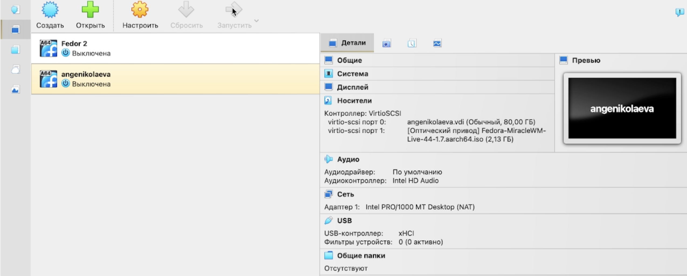{#fig-001 width=30%}

## 2) Настройка ресурсов
Указала объём оперативной памяти и размер диска 80 ГБ.

\begin{center}
\begin{minipage}{0.30\linewidth}
\centering
\includegraphics[width=\linewidth]{image/2.png}\\
\footnotesize Память виртуальной машины
\end{minipage}\hfill
\begin{minipage}{0.30\linewidth}
\centering
\includegraphics[width=\linewidth]{image/4.png}\\
\footnotesize Размер диска 80 ГБ
\end{minipage}
\end{center}

## 3) Подключение установочного ISO
Подключила ISO-образ Fedora Sway.

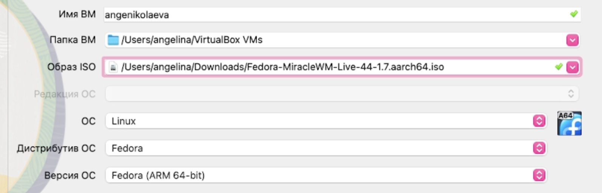{#fig-002 width=40%}

## 4) Параметры загрузки и виртуализации
Включила ускорение 3D/контроллер VMSVGA и поддержку UEFI.
## 5) Установка Fedora Sway
Установила систему на диск и завершил установку.

{#fig-002 width=78%}

# Первичная настройка Fedora

## Обновление и инструменты
Установила `development-tools` и обновила пакеты.

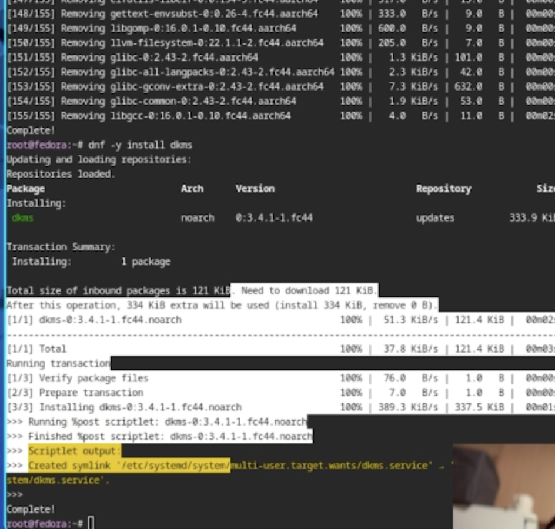{#fig-003 width=60%}

## SELinux и hostname
Перевёла SELinux в режим `permissive` и установил имя хоста по требованиям именования.

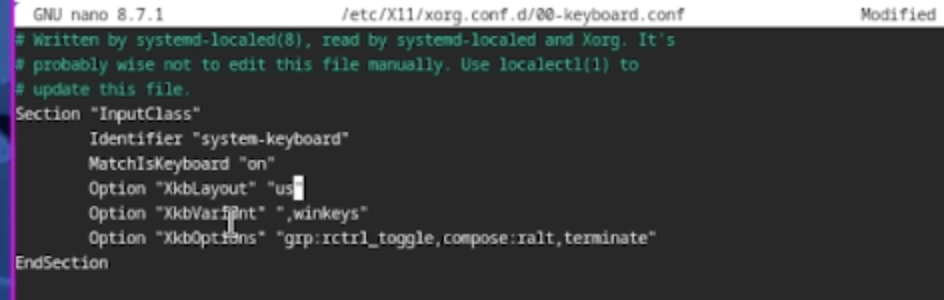{#fig-005 width=30%}

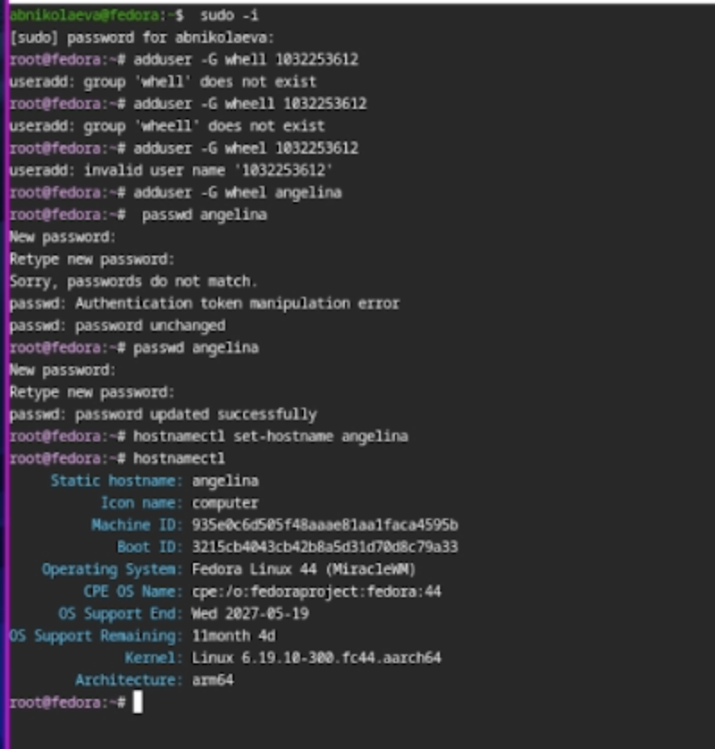{#fig-006 width=30%}

## Раскладка клавиатуры (Sway + system)
Создала пользовательский конфиг Sway и отредактировал системный конфиг клавиатуры.

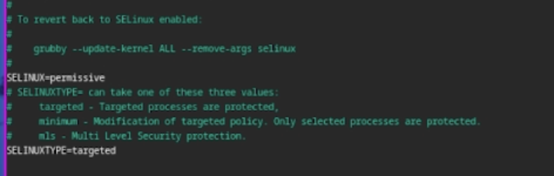{#fig-004 width=60%}

# ПО для отчётов и обмен файлами

## Pandoc и TeX Live
Установила `pandoc` и TeX Live для сборки PDF.

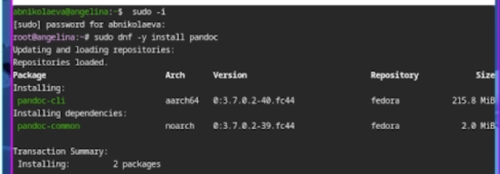{#fig-007 width=40%}

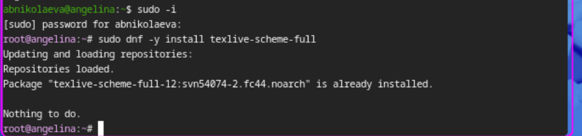{#fig-008 width=40%}

# Домашнее задание (dmesg)

## Ключевая системная информация (1/3)
Определила версию ядра Linux. Определила частоту и модель процессора.

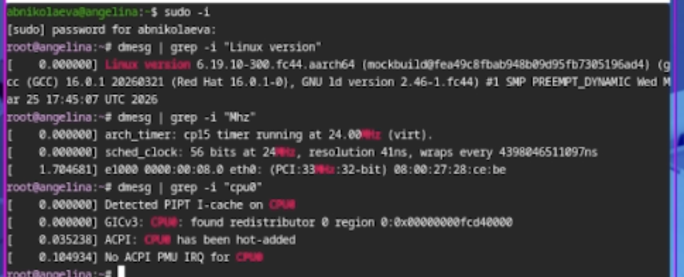{#fig-009 width=92%}

{#fig-009 width=92%}

{#fig-009 width=92%}

## Ключевая системная информация (2/3)
Определила объём доступной памяти и тип гипервизора.

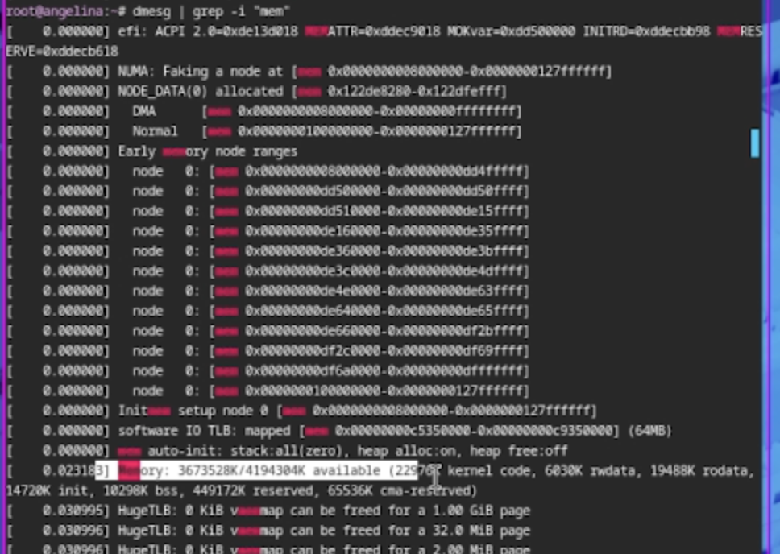{#fig-010 width=92%}

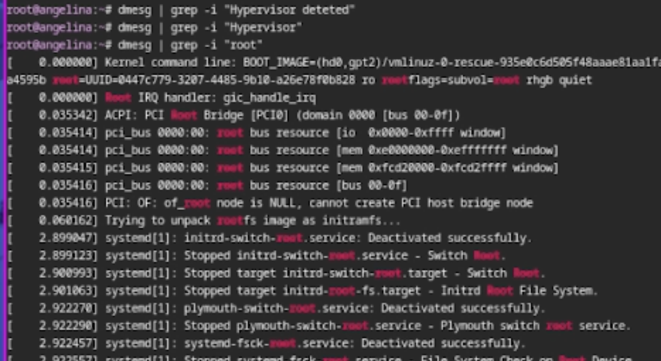{#fig-011 width=92%}

## Ключевая системная информация (3/3)
Определил тип файловой системы корневого раздела и последовательность монтирования ФС.

\begin{center}
\begin{minipage}{0.48\linewidth}
\centering
\includegraphics[width=\linewidth]{image/11.png}\\
\footnotesize Тип ФС корневого раздела
\end{minipage}\hfill
\begin{minipage}{0.48\linewidth}
\centering
\includegraphics[width=\linewidth]{image/10.png}\\
\footnotesize Последовательность монтирования ФС
\end{minipage}
\end{center}

# Итоги

## Выводы
- Создана ВМ в VirtualBox и установлена Fedora Sway.
- Выполнена первичная настройка: обновления, инструменты, SELinux, раскладка, hostname.
- Установлены `pandoc` и TeX Live; настроена общая папка для обмена файлами.
- По `dmesg` получены параметры загрузки и сведения об окружении (CPU, память, гипервизор, ФС).
:::