---
## Front matter
lang: ru-RU
title: Лабораторная работа №2
subtitle: Операционные системы
author:
  - Николаева А. Б.
institute:
  - Российский университет дружбы народов, Москва, Россия
date: 15 июня 2026

## i18n babel
babel-lang: russian
babel-otherlangs: english

## Formatting pdf
toc: false
toc-title: Содержание
slide_level: 2
aspectratio: 169
section-titles: true
theme: metropolis
header-includes:
 - \metroset{progressbar=frametitle,sectionpage=progressbar,numbering=fraction}
---

# Информация

## Докладчик

:::::::::::::: {.columns align=center}
::: {.column width="70%"}

  * Николаева Ангелина Борисовна
  * Студентка НКАбд-04-25
  * Российский университет дружбы народов
  * [1032253612@rudn.ru]

:::
::: {.column width="30%"}

:::
::::::::::::::

# Цель работы 

* изучить идеологию и применение средств контроля версий
* освоить умения по работе с git.

# Задание

* Создать базовую конфигурацию для работы с git.
* Создать ключ SSH.
* Cоздать ключ PGP.
* Настроить подписи git.
* Зарегистрироваться на Github.
* Создать локальный каталог для выполнения заданий по предмету.

# Теоретическое введение

Обычно основное дерево проекта хранится в локальном или удалённом репозитории, к которому настроен доступ для участников проекта. При внесении изменений в содержание проекта система контроля версий позволяет их фиксировать, совмещать изменения, произведённые разными участниками проекта, производить откат к любой более ранней версии проекта, если это требуется. Изучим базовые возможности GitHub.

# Выполнение лабораторной работы

## Установка программного обеспечения

Установила git и gh .

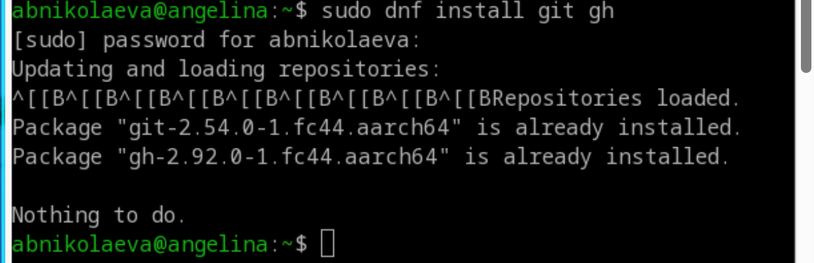

## Базовая настройка git

Задала имя и email владельца репозитория, задала имя начальной ветки, настроила autocrlf и safecrlf.

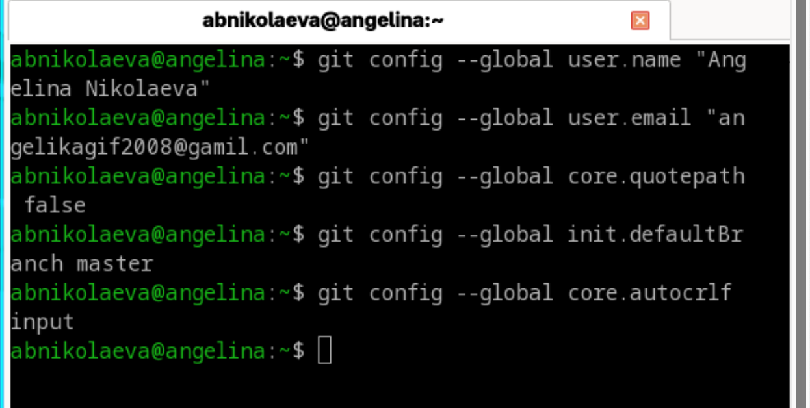

## Создание SSH ключа

- по алгоритму rsa с ключом размером 4096 бит.

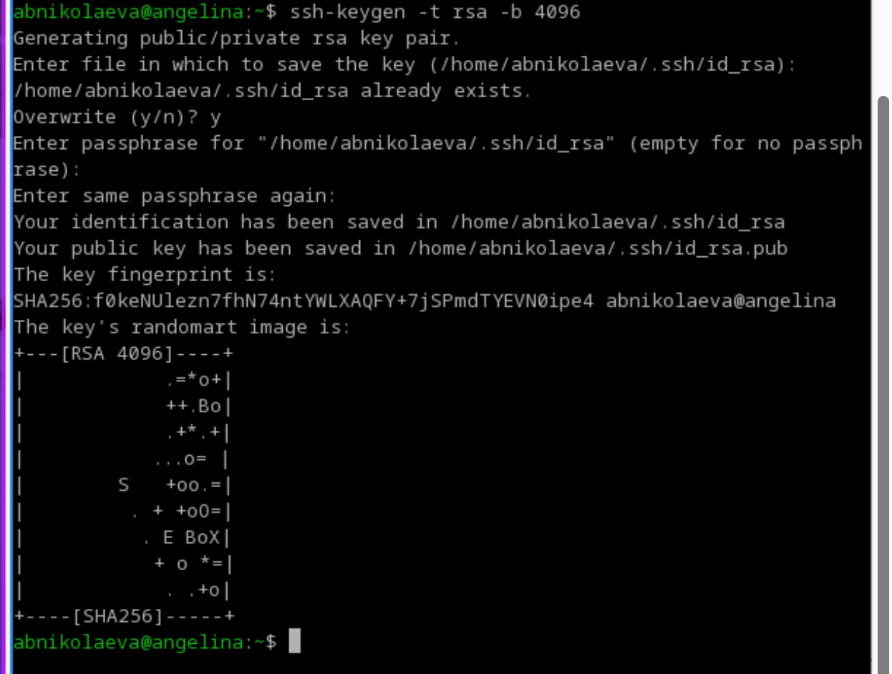

- по алгоритму ed25519

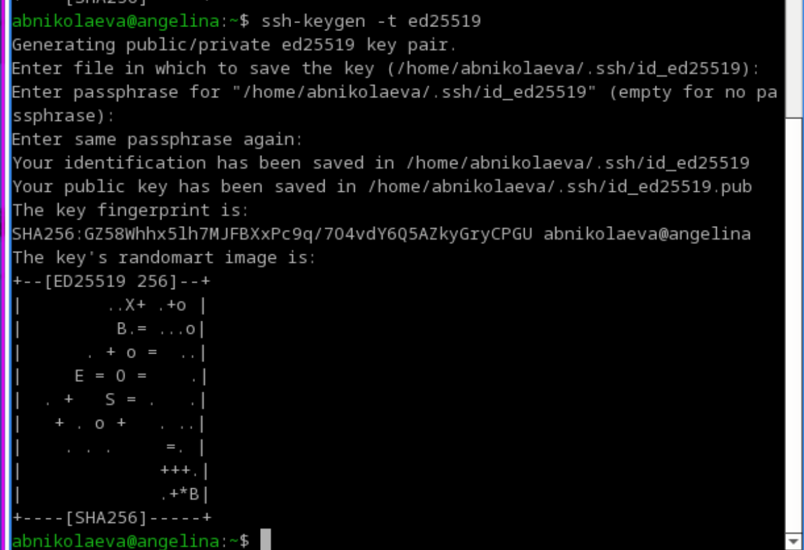

## Создание ключа PGP

Создала ключ PGP.

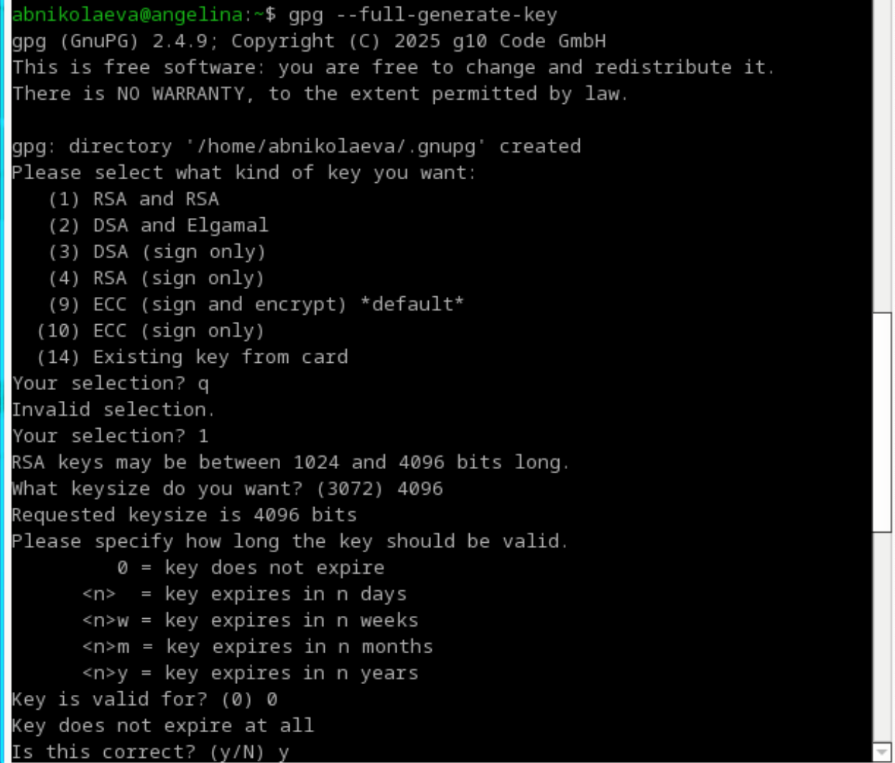

## Настройка GitHub

В моём случае учётная запись на GitHub с основными данными уже была создана.

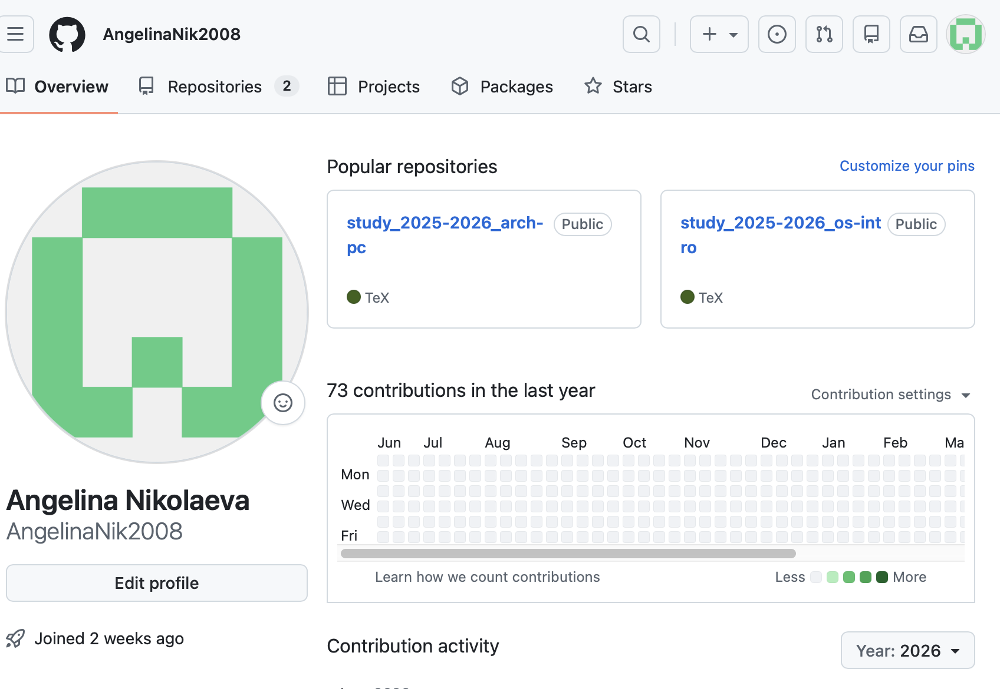

## Добавление GPG ключа в GitHub

Вывела список ключей.

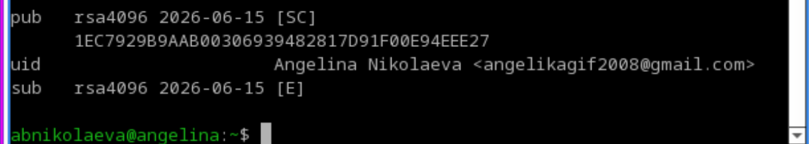

##
Перешла в настройки GitHub, нажала на кнопку New GPG key и вставила полученный ключ в поле ввода.

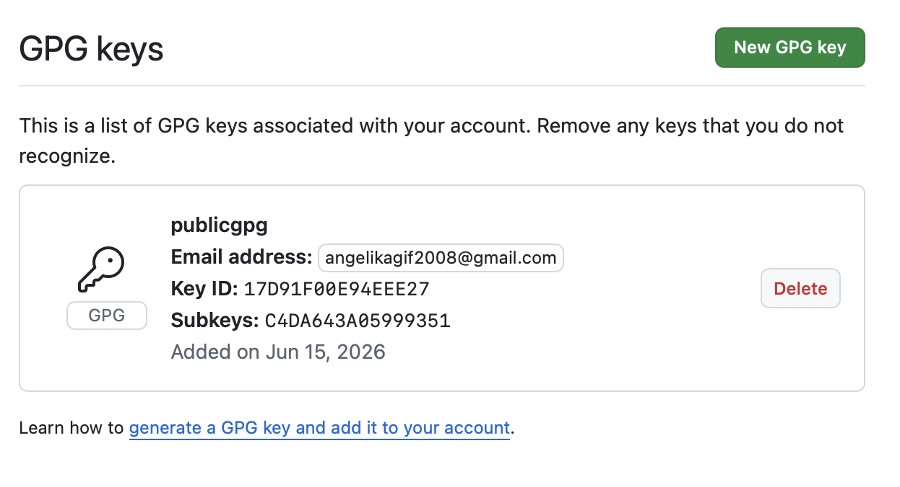

## Настройка автоматических подписей коммитов git

Используя введённый email, указала Git применять его при подписи коммита.

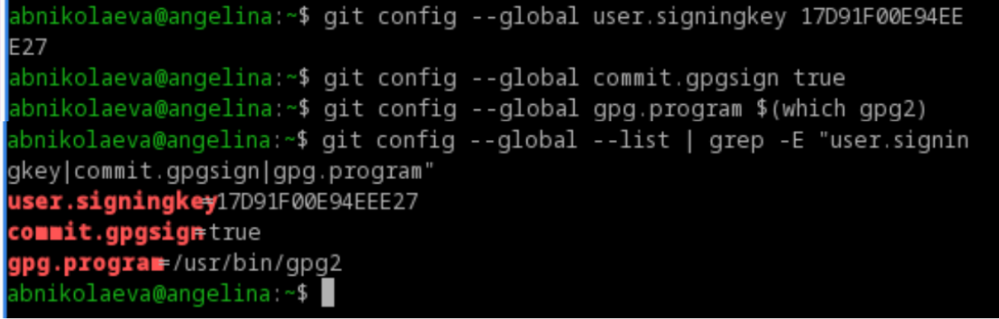

## Настройка gh

Авторизация `gh auth login`.

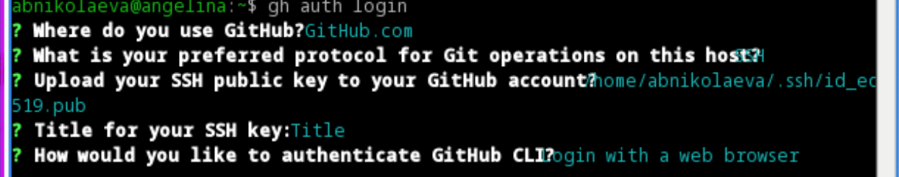

## Создание репозитория курса на основе шаблона

Создала репозиторий курса на основе шаблона.

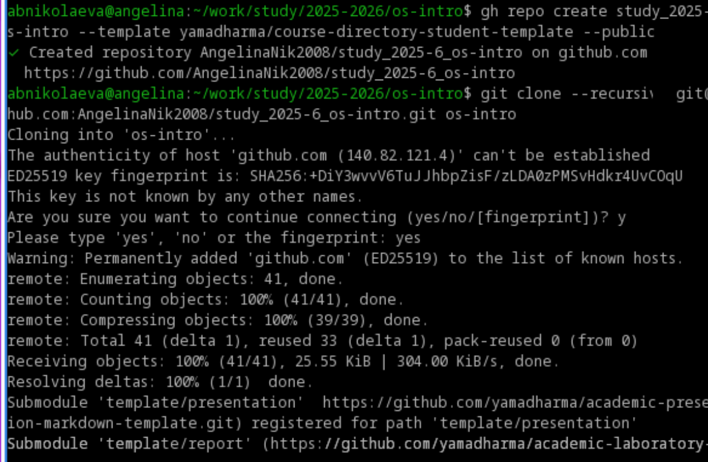

## Настройка каталога курса

Перешла в каталог курса, удалила лишние файлы, создала необходимые каталоги и отправила данные на сервер .

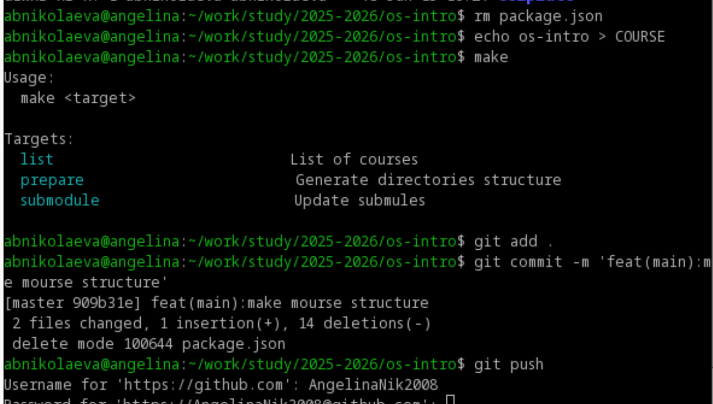

# Выводы

В ходе данной лабораторной работы я изучила идеологию и применение средств контроля версий и освоила умения по работе с Git.
