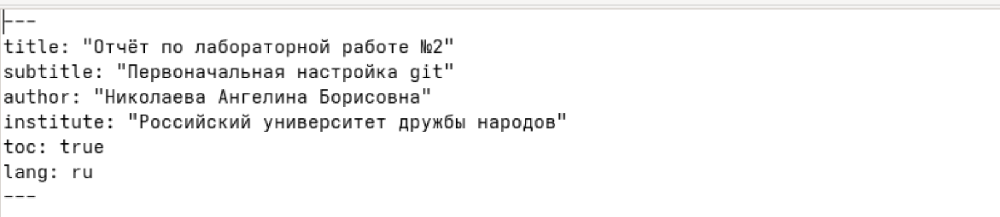
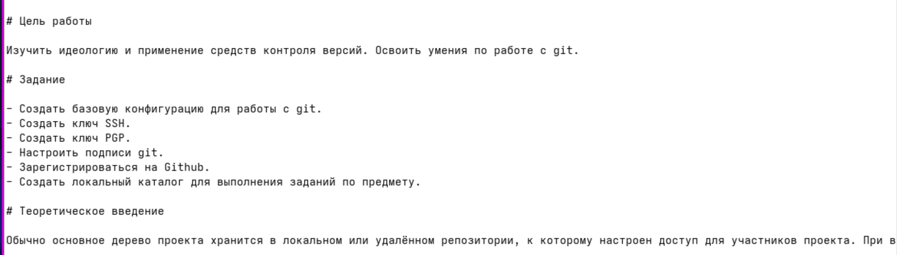
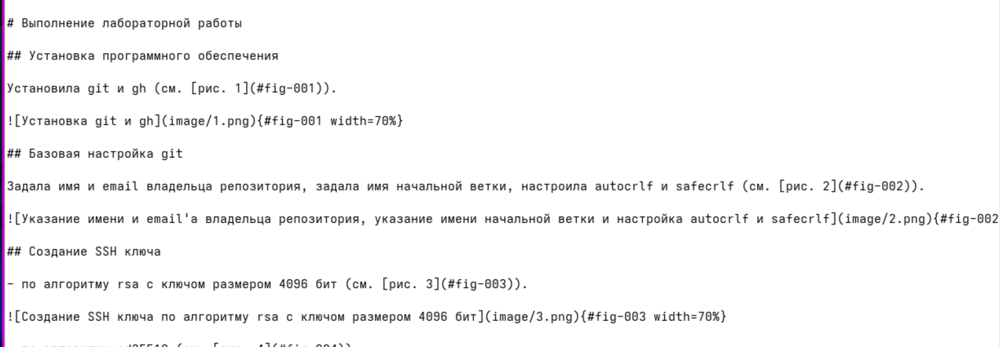
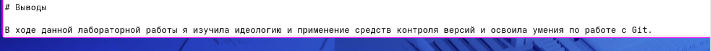

---
## Front matter
lang: ru-RU
title: Лабораторная работа №3
subtitle: Операционные системы
author:
  - Николаева А. Б.
institute:
  - Российский университет дружбы народов, Москва, Россия
date: 15 июня 2026

## i18n babel
babel-lang: russian
babel-otherlangs: english

## Formatting pdf
toc: false
toc-title: Содержание
slide_level: 2
aspectratio: 169
section-titles: true
theme: metropolis
header-includes:
 - \metroset{progressbar=frametitle,sectionpage=progressbar,numbering=fraction}
---

# Информация

## Докладчик

:::::::::::::: {.columns align=center}
::: {.column width="70%"}

  * Николаева Ангелина Борисовна
  * Студентка НКАбд-04-25
  * Российский университет дружбы народов
  * [1032253612@rudn.ru]

:::
::: {.column width="30%"}


:::
::::::::::::::

# Цель работы 

Научиться оформлять отчеты с помощью легковесного языка разметки Markdown

# Задание

- Сделать отчёт по предыдущей лабораторной работе в формате Markdown.
- Предоставить отчёты в трёх форматах: `pdf`, `docx` и `md`.

# Теоретическое введение

---

## Основы Markdown

**Заголовки:** `# H1`, `## H2`, `### H3`, `#### H4`  
**Форматирование:** `**bold**`, `*italic*`, `***bold+italic***`  
**Цитаты:** `> text`  
**Списки:** маркированные (`-` или `*`), нумерованные (`1.`) с поддержкой вложенности  
**Ссылки:** `[текст](file.md)`  
**Код:** встроенный или блоки с указанием языка  
**Формулы:** внутритекстовые (`$...$`) и выключные (`$$...$$`) с возможностью ссылок

---

## Обработка Markdown-файлов

**Инструменты:** Pandoc (`pandoc`), pandoc-citeproc, pandoc-crossref

**Базовые команды:**
```bash
pandoc README.md -o README.pdf   # в PDF
pandoc README.md -o README.docx  # в Word

# Выполнение лабораторной работы

## Основная информация

Указала основную информацию о лабораторной работе.



## Цель и теоретическое введение 

Указала цель, задание и теоретическое введение лабораторной работы.



## Процесс выполнения

Описала процесс выполнения лабораторной работы.



## Контрольные вопросы и выводы

Ответила на контрольные вопросы.

Описала выводы к лабораторной работе.



# Выводы

В ходе данной лабораторной работы я научился оформалять отчёты с помощью легковесного языка разметки Markdown.

