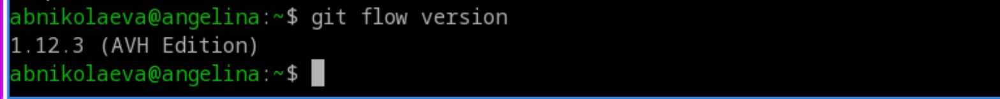
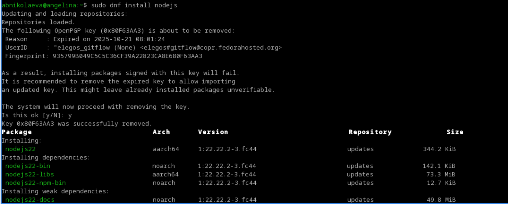
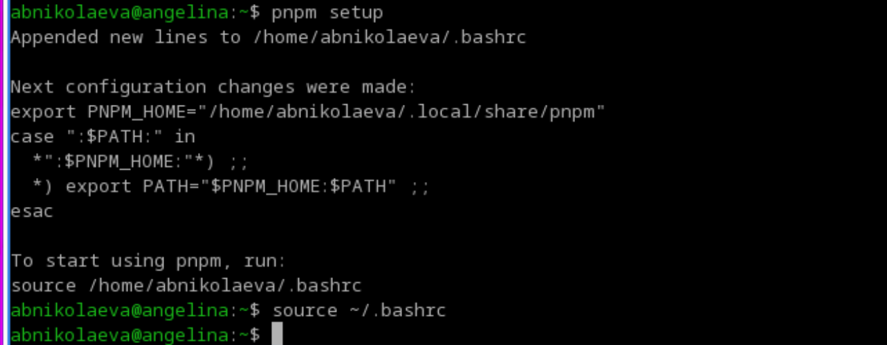
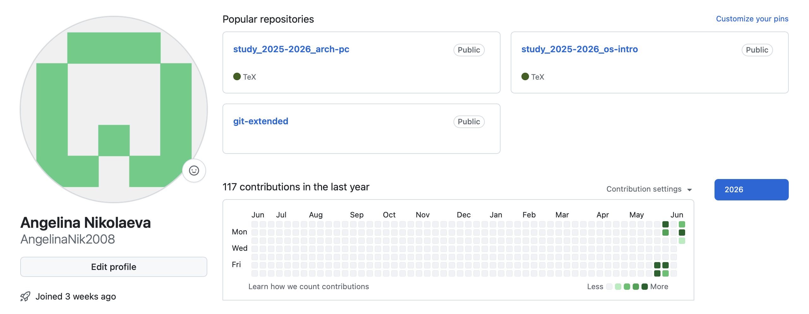
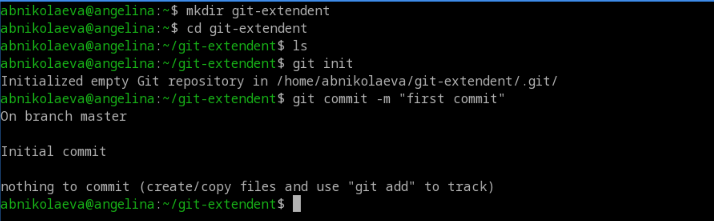
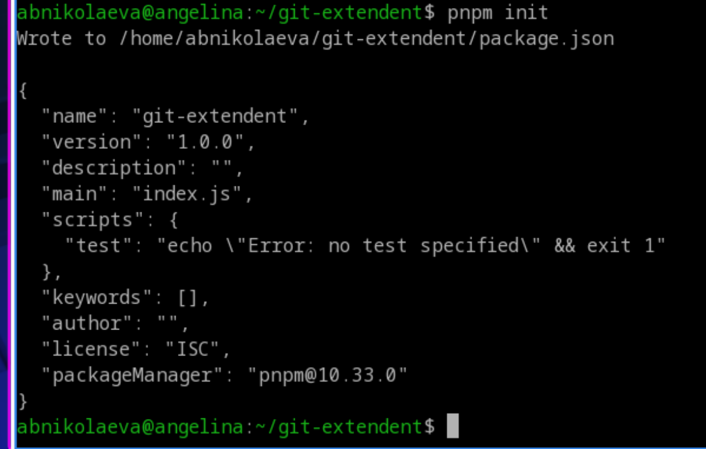
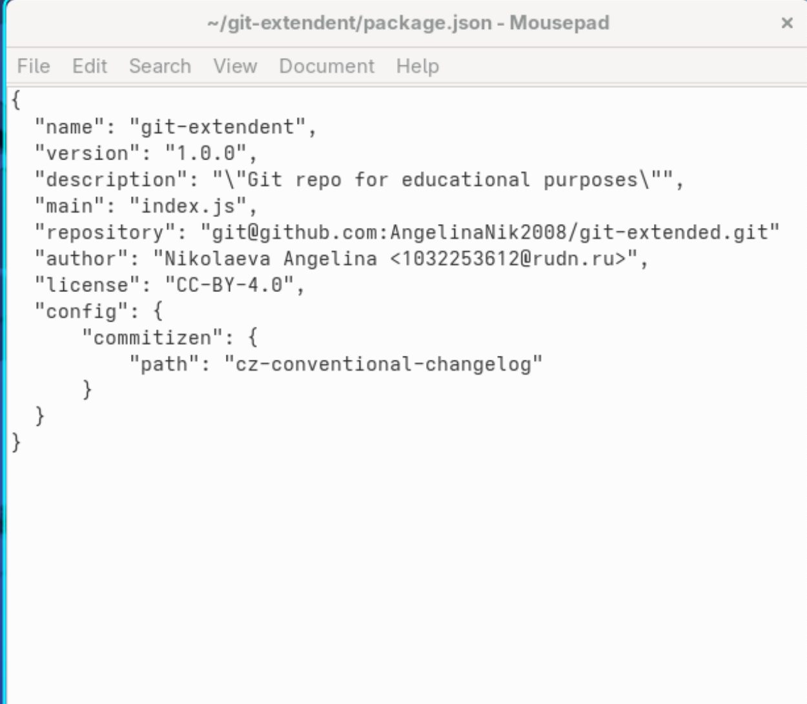
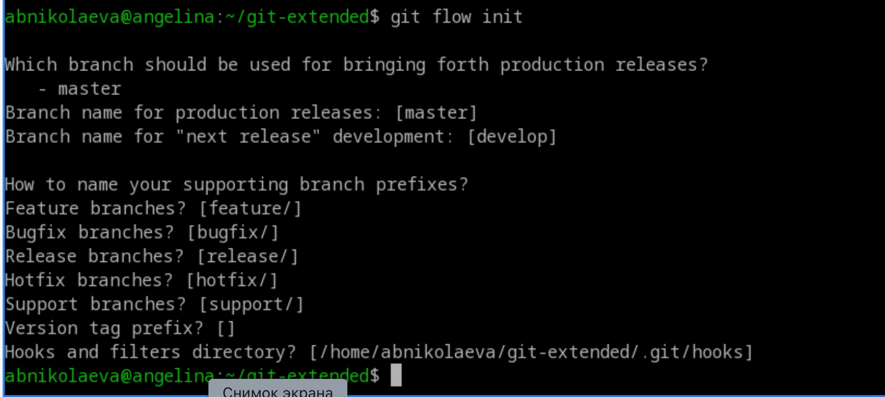
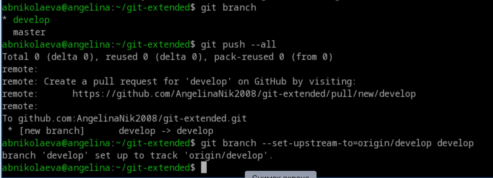
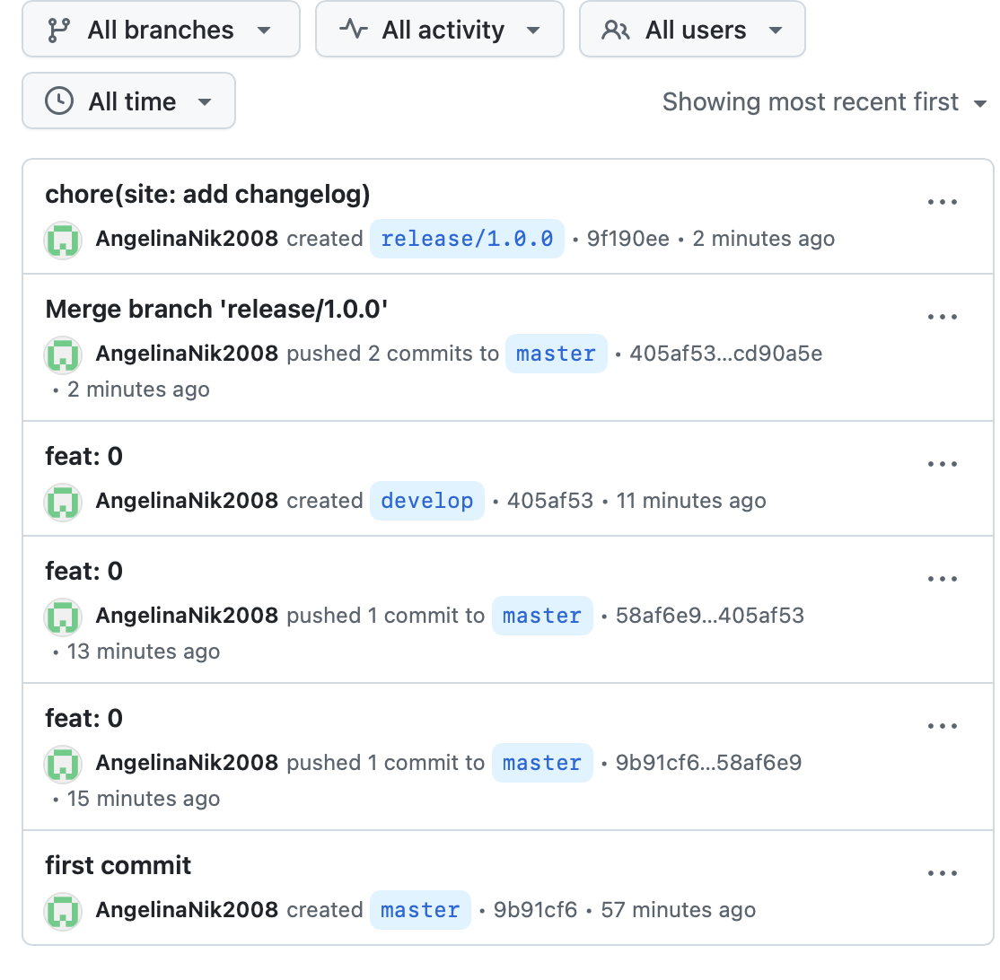

---
## Front matter
lang: ru-RU
title: Лабораторная работа №4
subtitle: Операционные системы
author:
  - Николаева А. Б.
institute:
  - Российский университет дружбы народов, Москва, Россия
date: 15 июня 2026

## i18n babel
babel-lang: russian
babel-otherlangs: english

## Formatting pdf
toc: false
toc-title: Содержание
slide_level: 2
aspectratio: 169
section-titles: true
theme: metropolis
header-includes:
 - \metroset{progressbar=frametitle,sectionpage=progressbar,numbering=fraction}
---

# Информация

## Докладчик

:::::::::::::: {.columns align=center}
::: {.column width="70%"}

  * Николаева Ангелина Борисовна
  * Студентка НКАбд-04-25
  * Российский университет дружбы народов
  * [1032253612@rudn.ru]

:::
::: {.column width="30%"}

:::
::::::::::::::

# Цель работы 

Получение навыков правильной работы с репозиториями git.

# Задание

Научиться работать с git на более высоком уровне.

# Выполнение лабораторной работы

## Установка git-flow

Установила git-flow.

## Установка Node.js

Установила Node.

## Настройка Node.js

Запустила `pnpm setup` и выполнила `source ~/.bashrc`.

## Практический сценарий использования git

 Подключение репозитория к github

- Создала репозиторий на GitHub. Назвала его `git-extended`.

## Сделала первый коммит и выложила его на github.

## Конфигурация общепринятых коммитов.

- Конфигурация пакетов Node.js .

Заполнила несколько параметров пакета и сконфигурировала формат коммитов.

## Конфигурация git-flow

- Инициализировала git-flow.

## 

- Проверила, что я на ветке `develop`, загрузила весь репозиторий в хранилище, установила внешнюю ветку как вышестоящую для этой ветки и создала релиз с версией 1.0.0.

### Работа с репозиторием git

## Создание релиза git-flow

- Создала релиз с версией `1.2.3`, обновила номер версии в `package.json`, создала журнал изменений и добавила журнал изменений в индекс, залила релизную ветку в основную ветку.

## 

- Отправила данные на github, создала релиз на github с комментариями из журнала изменений.

# Выводы

В ходе данной лабораторной работы были получены навыки правильной работы с репозиториями git.
