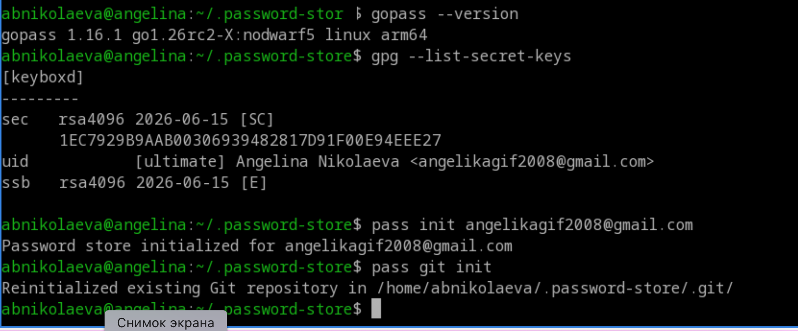
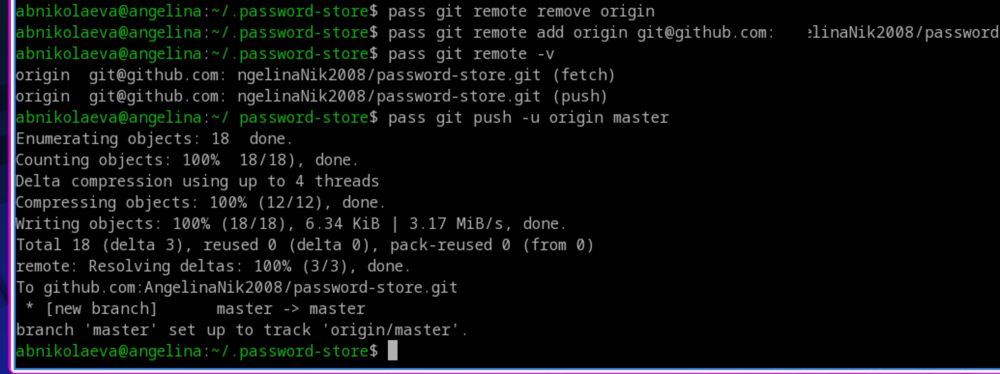
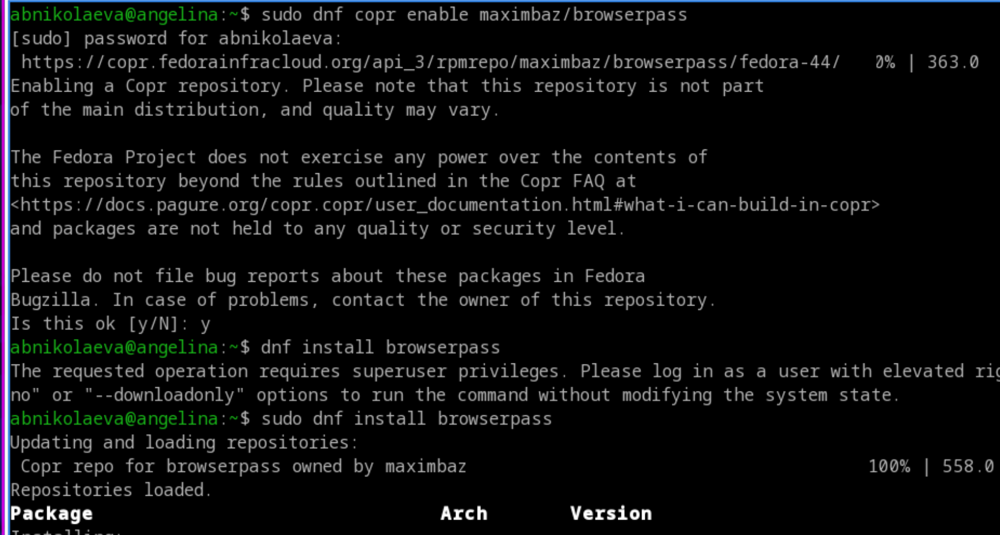
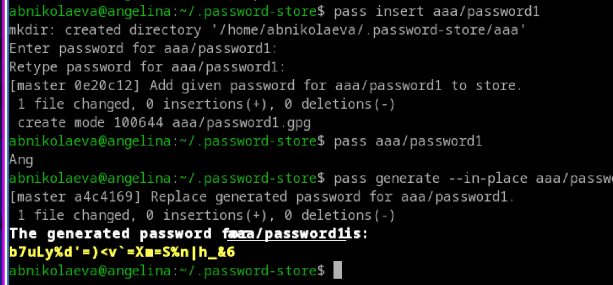
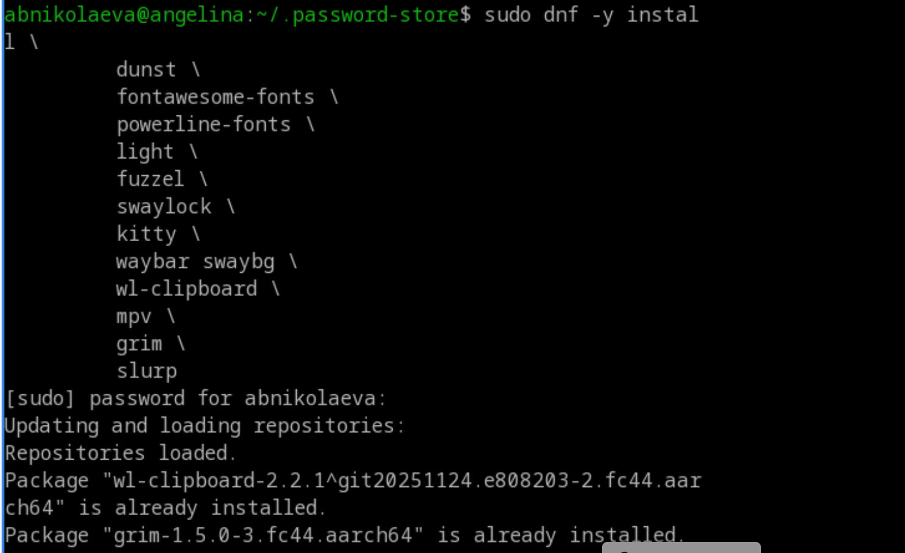
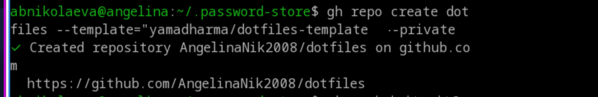
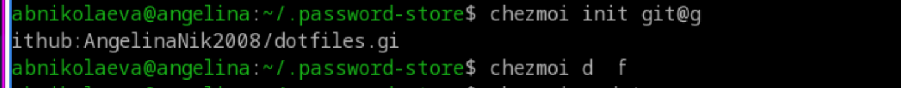
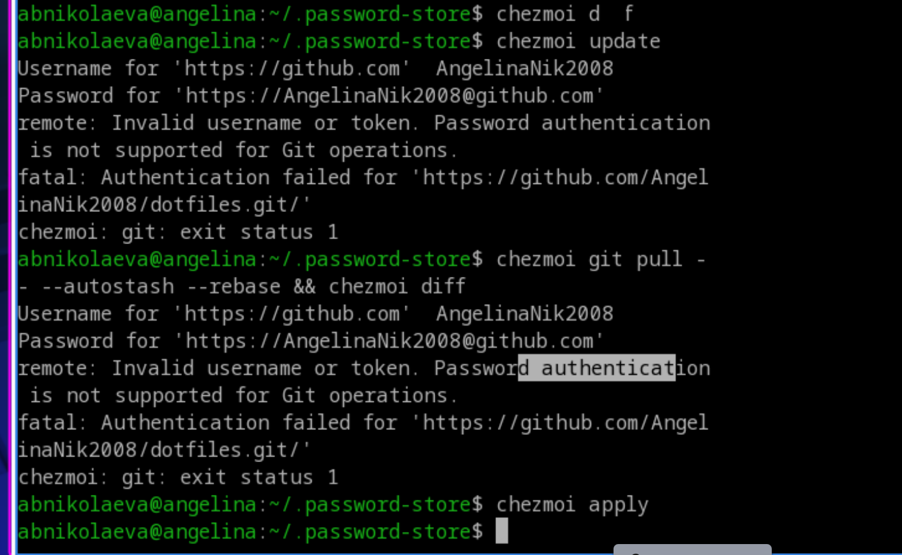

---
## Author
author:
  name: Николаева Ангелина Борисовна
  degrees: DSc
  orcid: 0000-0002-0877-7063
  email: 1032253612@rudn.ru
  affiliation:
    - name: Российский университет дружбы народов
      country: Российская Федерация
      postal-code: 117198
      city: Москва
      address: ул. Миклухо-Маклая, д. 6

## Title
title: "Лабораторная работа №5"
subtitle: "Настройка рабочей среды"
license: "CC BY"
---                                                                                 |

# 1. Цель работы

Познакомиься с менеджером паролей pass, научится управлению файлами конфигурации chezmoi, настроить рабочую среду.

# 2. Задание

- Установить дополнительное ПО
- Установить и настроить pass
- Настроить интерфейс с браузером
- Сохранить пароль
- Установить и настроить chezmoi
- Настроить chezmoi на новой машине
- Выполнить ежедневные операции с chezmoi

# 3. Теоретическое введение

Менеджер паролей pass — программа, сделанная в рамках идеологии Unix. Также носит название стандартного менеджера паролей для Unix (The standard Unix password manager). 1.1 Основные свойства Данные хранятся в файловой системе в виде каталогов и файлов. Файлы шифруются с помощью GPG-ключа. 1.2 Структура базы паролей Структура базы может быть произвольной, если Вы собираетесь использовать её напрямую, без промежуточного программного обеспечения. Тогда семантику структуры базы данных Вы держите в своей голове. Если же необходимо использовать дополнительное программное обеспечение, необходимо семантику заложить в структуру базы паролей. chezmoi используется для управления файлами конфигурации домашнего каталога пользователя. Конфигурация chezmoi 2.2.1 Рабочие файлы Состояние файлов конфигурации сохраняется в каталоге ~/.local/share/chezmoi. Он является клоном вашего репозитория dotfiles. Файл конфигурации ~/.config/chezmoi/chezmoi.toml (можно использовать также JSON или YAML) специфичен для локальной машины. Файлы, содержимое которых одинаково на всех ваших машинах, дословно копируются из исходного каталога. Файлы, которые варьируются от машины к машине, выполняются как шаблоны, обычно с использованием данных из файла конфигурации локальной машины для настройки конечного содержимого, специфичного для локальной машины.

# 4. Выполнение лабораторной работы

## Менеджер паролей pass

Установка pass
![Установка pass] (image/1.png){#fig-001 width=70%}

Инициализирую хранилище через ключ GPG, синхронизируюсь с git

{#fig-002 width=70%}

Отправляю данные на сервер

{#fig-003 width=70%}

## Настройка интерфейса с броузером

Установка native messaging

{#fig-004 width=70%}

## Сохранение пароля

{#fig-005 width=70%}

## Управление файлами конфигурации

{#fig-006 width=70%}

![Установка бинарного файла] (image/7.png){#fig-007 width=70%}

## Создание собственного репозитория с помощью утилит

{#fig-008 width=70%}

## Подключение репозитория к своей системе

Инициализирую chezmoi с моим репозиторием

{#fig-009 width=70%}

## Ежедневные операции c chezmoi

Извлекаю последние изменения из репозитория, проверяю и применяю их

{#fig-010 width=70%}

# 5. Выводы

Во время выполнения лабораторной работы я получила навыки правильной работы с pass и chezmoi.

# Список литературы{.unnumbered}

::: {#refs}
:::
