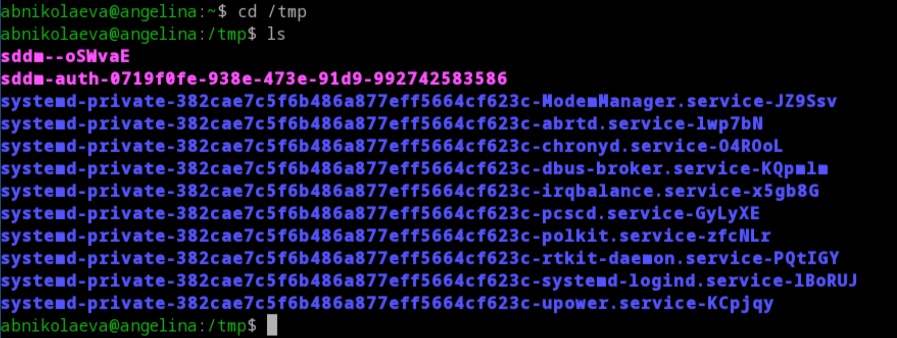
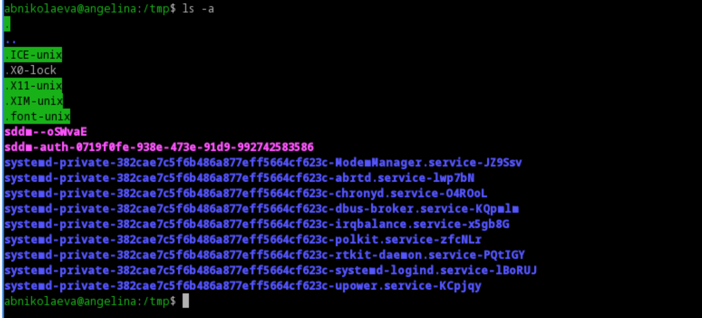
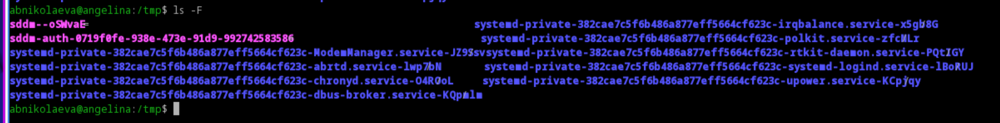
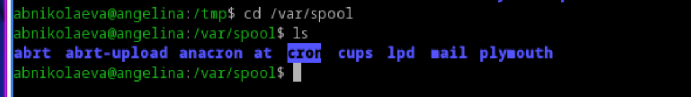
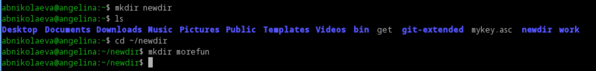
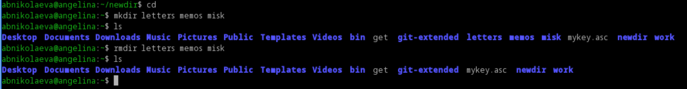
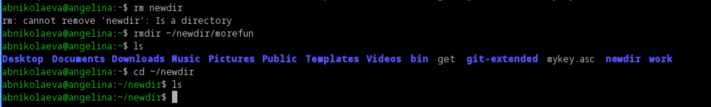
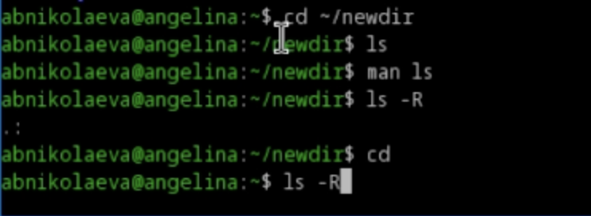
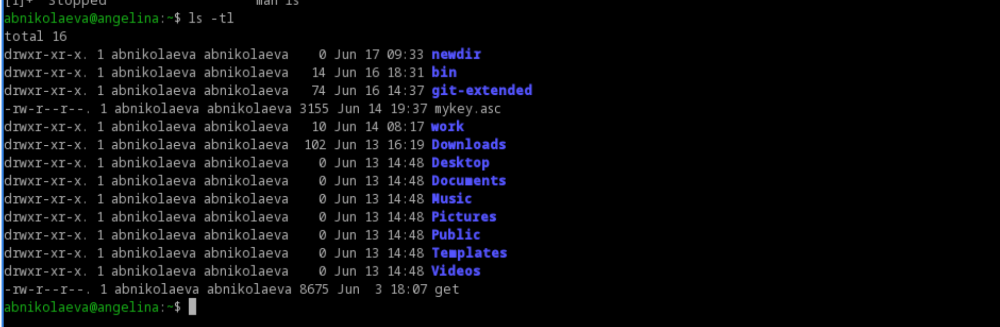

---
## Front matter
lang: ru-RU
title: Лабораторная работа №6
subtitle: Операционные системы
author:
  - Николаева А. Б.
institute:
  - Российский университет дружбы народов, Москва, Россия
date: 19 июня 2026

## i18n babel
babel-lang: russian
babel-otherlangs: english

## Formatting pdf
toc: false
toc-title: Содержание
slide_level: 2
aspectratio: 169
section-titles: true
theme: metropolis
header-includes:
 - \metroset{progressbar=frametitle,sectionpage=progressbar,numbering=fraction}
---

# Информация

## Докладчик

:::::::::::::: {.columns align=center}
::: {.column width="70%"}

  * Николаева Ангелина Борисовна
  * Студентка НКАбд-04-25
  * Российский университет дружбы народов
  * [1032253612@rudn.ru]

:::
::: {.column width="30%"}

:::
::::::::::::::

# Цель работы 

Приобретение практических навыков взаимодействия пользователя с системой посредством командной строки.

# Задание
1. Определите полное имя вашего домашнего каталога.
2. Поработайте с командой ls
3. Поработайте с командой mkdir и rmdir
4. С помощью команды man определите, какую опцию команды ls нужно использо-
вать для просмотра содержимое не только указанного каталога, но и подкаталогов,
входящих в него.
5. С помощью команды man определите набор опций команды ls, позволяющий отсортировать по времени последнего изменения выводимый список содержимого каталога с развёрнутым описанием файлов.
6. Используйте команду man для просмотра описания следующих команд: cd, pwd, mkdir, rmdir, rm. Поясните основные опции этих команд.
7. Используя информацию, полученную при помощи команды history, выполните модификацию и исполнение нескольких команд из буфера команд.

# Выполнение лабораторной работы

Определяю полное имя вашего домашнего каталога. Перехожу в каталог /tmp.

##

Вывожу на экран содержимое каталога /tmp с разными опциями.

##

ls-a выводит скрытые файлы

##

ls-F выводит тип файла

##

ls-l выводит развёрнутую информацию

##

##

В каталоге /var/spool есть подкаталог с именем cron

##

Смотрю содержимое домашнего каталога. Владелец - я

##

Создаю папку newdir, внутри неё создаю каталог morefun

##

В домашнем каталоге создаю одной командой три новых каталога с именами letters, memos, misk. Затем удаляю эти каталоги одной командой.

##

Пробую удалить ранее созданный каталог ~/newdir командой rm. Не получается. Использую rmdir

##

С помощью команды man определяю, какую опцию команды ls нужно использовать для просмотра содержимое не только указанного каталога, но и подкаталогов,
входящих в него.

##

С помощью команды man определите набор опций команды ls, позволяющий отсортировать по времени последнего изменения выводимый список содержимого каталога развёрнутым описанием файлов

##

Используйте команду man для просмотра описания следующих команд: cd, pwd, mkdir, rmdir, rm.

##

Используя информацию, полученную при помощи команды history, выполняю модификацию и исполнение нескольких команд из буфера команд.

# Выводы

Во время выполнения лабораторной работы я приобрела практические навыки взаимодействия пользователя с системой посредством командной строки.

