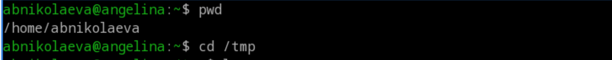
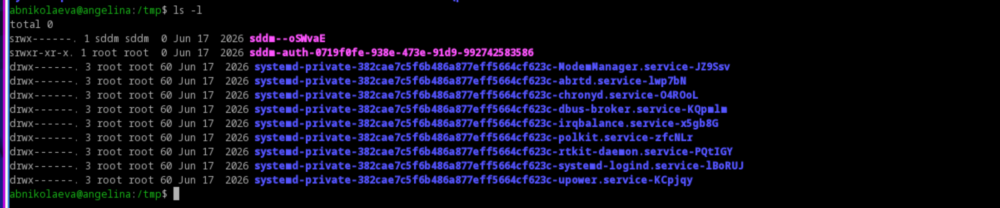
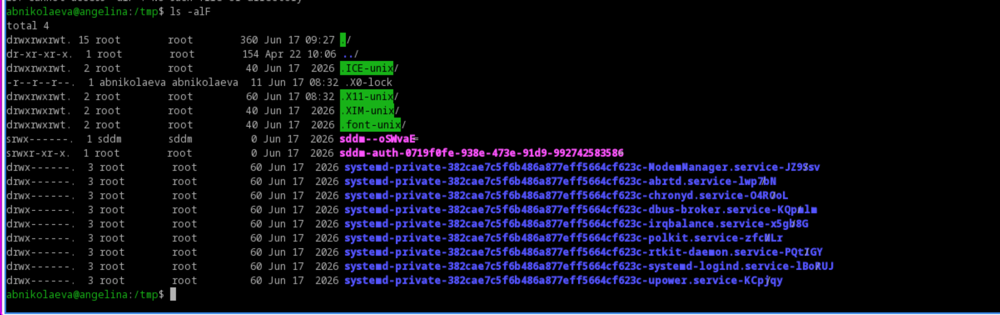
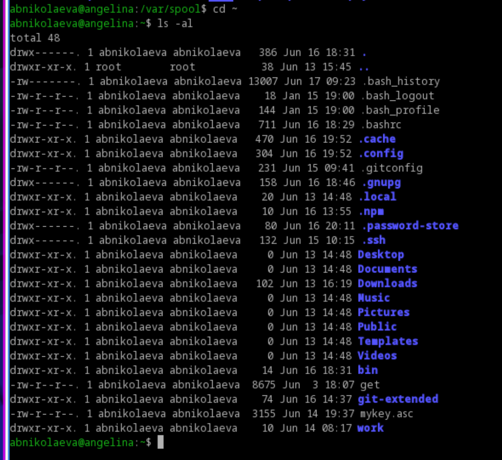

---
## Author
author:
  name: Николаева Ангелина Борисовна 
  degrees: DSc
  orcid: 0000-0002-0877-7063
  email: 1032253612@rudn.ru
  affiliation:
    - name: Российский университет дружбы народов
      country: Российская Федерация
      postal-code: 117198
      city: Москва
      address: ул. Миклухо-Маклая, д. 6

## Title
title: "Отчет по лабораторной работе №6"
subtitle: "Основы интерфейса взаимодействия пользователя с системой Unix на уровне командной строки"
license: "CC BY"
---

# 1. Цель работы

Приобретение практических навыков взаимодействия пользователя с системой посредством командной строки.

# 2. Задание

1. Определите полное имя вашего домашнего каталога.
2. Поработайте с командой ls
3. Поработайте с командой mkdir и rmdir
4. С помощью команды man определите, какую опцию команды ls нужно использо-
вать для просмотра содержимое не только указанного каталога, но и подкаталогов,
входящих в него.
5. С помощью команды man определите набор опций команды ls, позволяющий отсорти-
ровать по времени последнего изменения выводимый список содержимого каталога
с развёрнутым описанием файлов.
6. Используйте команду man для просмотра описания следующих команд: cd, pwd, mkdir, rmdir, rm. Поясните основные опции этих команд.
7. Используя информацию, полученную при помощи команды history, выполните мо-
дификацию и исполнение нескольких команд из буфера команд.

# 3. Теоретическое введение

В операционной системе типа Linux взаимодействие пользователя с системой обычно
осуществляется с помощью командной строки посредством построчного ввода команд. При этом обычно используется командные интерпретаторы языка shell: /bin/sh; /bin/csh; /bin/ksh.
Командой в операционной системе называется записанный по
специальным правилам текст (возможно с аргументами), представляющий собой указание на выполнение какой-либо функций (или действий) в операционной системе.
Обычно первым словом идёт имя команды, остальной текст — аргументы или опции, конкретизирующие действие.
Общий формат команд можно представить следующим образом:
<имя_команды><разделитель><аргументы>

# 4. Выполнение лабораторной работы

Определяю полное имя вашего домашнего каталога. Перехожу в каталог /tmp.

{#fig-001 width=70%}

Вывожу на экран содержимое каталога /tmp с разными опциями.

![ls] (image/2.png){#fig-002 width=70%}

-a выводит скрытые файлы

![ls -a] (image/3.png){#fig-003 width=70%}

-F выводит тип файла

{#fig-004 width=70%}

-l выводит развёрнутую информацию

{#fig-005 width=70%}

{#fig-006 width=70%}

В каталоге /var/spool есть подкаталог с именем cron

{#fig-007 width=70%}

Смотрю содержимое домашнего каталога. Владелец - я

{#fig-008 width=70%}

Создаю папку newdir, внутри неё создаю каталог morefun

{#fig-009 width=70%}

В домашнем каталоге создаю одной командой три новых каталога с именами
letters, memos, misk. Затем удаляю эти каталоги одной командой.

{#fig-010 width=70%}

Пробую удалить ранее созданный каталог ~/newdir командой rm. Не получается. Использую rmdir

{#fig-011 width=70%}

С помощью команды man определяю, какую опцию команды ls нужно использовать для просмотра содержимое не только указанного каталога, но и подкаталогов,
входящих в него.

{#fig-012 width=70%}

С помощью команды man определите набор опций команды ls, позволяющий отсортировать по времени последнего изменения выводимый список содержимого каталога развёрнутым описанием файлов
{#fig-013 width=70%}

Используйте команду man для просмотра описания следующих команд: cd, pwd, mkdir,
rmdir, rm.

{#fig-014 width=70%}

Используя информацию, полученную при помощи команды history, выполняю модификацию и исполнение нескольких команд из буфера команд.

![history]](image/15.png){#fig-015 width=70%}

# 5. Выводы

Во время выполнения лабораторной работы я приобрела практические навыки взаимодействия пользователя с системой посредством командной строки.

# Список литературы{.unnumbered}

::: {#refs}
:::
