---
## Front matter
lang: ru-RU
title: Лабораторная работа №7
subtitle: Операционные системы
author:
  - Николаева А. Б.
institute:
  - Российский университет дружбы народов, Москва, Россия
date: 19 июня 2026

## i18n babel
babel-lang: russian
babel-otherlangs: english

## Formatting pdf
toc: false
toc-title: Содержание
slide_level: 2
aspectratio: 169
section-titles: true
theme: metropolis
header-includes:
 - \metroset{progressbar=frametitle,sectionpage=progressbar,numbering=fraction}
---

# Информация

## Докладчик

:::::::::::::: {.columns align=center}
::: {.column width="70%"}

  * Николаева Ангелина Борисовна
  * Студентка НКАбд-04-25
  * Российский университет дружбы народов
  * [1032253612@rudn.ru]

:::
::: {.column width="30%"}

:::
::::::::::::::

# Цель работы 

* ознакомление с файловой системой Linux, её структурой, именами и содержанием каталогов

* приобретение практических навыков по применению команд для работы с файлами и каталогами, по управлению процессами (и работами), по проверке использования диска и обслуживанию файловой системы

# Задание

1. Выполните все примеры, приведённые в первой части описания лабораторной работы.
2. Выполните следующие действия, зафиксировав в отчёте по лабораторной работе используемые при этом команды и результаты их выполнения:
- 2.1. Скопируйте файл /usr/include/sys/io.h в домашний каталог и назовите его equipment. Если файла io.h нет, то используйте любой другой файл в каталоге /usr/include/sys/ вместо него.
- 2.2. В домашнем каталоге создайте директорию ~/ski.plases.
- 2.3. Переместите файл equipment в каталог ~/ski.plases.
- 2.4. Переименуйте файл ~/ski.plases/equipment в ~ski.plases/equiplist.
- 2.5. Создайте в домашнем каталоге файл abc1 и скопируйте его в каталог ~/ski.plases, назовите его equiplist2.

##
- 2.6. Создайте каталог с именем equipment в каталоге ~/ski.plases.
- 2.7. Переместите файлы ~/ski.plases/equiplist и equiplist2 в каталог ~/ski.plases/equipment.
- 2.8. Создайте и переместите каталог ~/newdir в каталог ~/ski.plases и назовите его plans.

3. Определите опции команды chmod, необходимые для того, чтобы присвоить перечисленным ниже файлам выделенные права доступа, считая, что в начале таких прав нет:
- 3.1. drwxr--r-- ... australia
- 3.2. drwx--x--x ... play
- 3.3. -r-xr--r-- ... my_os
- 3.4. -rw-rw-r-- ... feathers
При необходимости создайте нужные файлы.

##
4. Проделайте приведённые ниже упражнения, записывая в отчёт по лабораторной работе используемые при этом команды:
- 4.1. Просмотрите содержимое файла /etc/password.
- 4.2. Скопируйте файл ~/feathers в файл ~/file.old.
- 4.3. Переместите файл ~/file.old в каталог ~/play.
- 4.4. Скопируйте каталог ~/play в каталог ~/fun.
- 4.5. Переместите каталог ~/fun в каталог ~/play и назовите его games.
- 4.6. Лишите владельца файла ~/feathers права на чтение.
- 4.7. Что произойдёт, если вы попытаетесь просмотреть файл ~/feathers командой cat?
- 4.8. Что произойдёт, если вы попытаетесь скопировать файл ~/feathers?
- 4.9. Дайте владельцу файла ~/feathers право на чтение.
- 4.10. Лишите владельца каталога ~/play права на выполнение.

##
- 4.11. Перейдите в каталог ~/play. Что произошло?
- 4.12. Дайте владельцу каталога ~/play право на выполнение.
5. Прочитайте man по командам mount, fsck, mkfs, kill и кратко их охарактеризуйте, приведя примеры.

# Теоретическое введение

Для создания текстового файла можно использовать команду touch.
Формат команды:
- touch имя-файла
Для просмотра файлов небольшого размера можно использовать команду cat.
Формат команды:
- cat имя-файла

# Выполнение лабораторной работы

*1.* Выполните все примеры, приведённые в первой части описания лабораторной работы.

Копирую файл ~/abc1 в файл april и в файл may

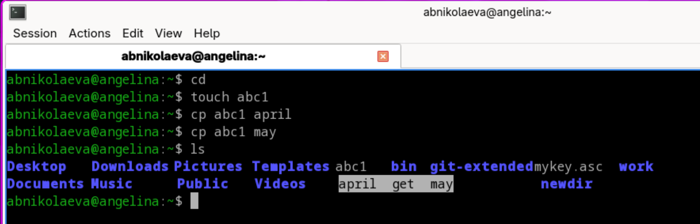

##

Копирую файлы april и may в каталог monthly

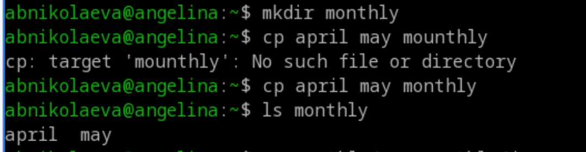

##

Копирую файл monthly/may в файл с именем june

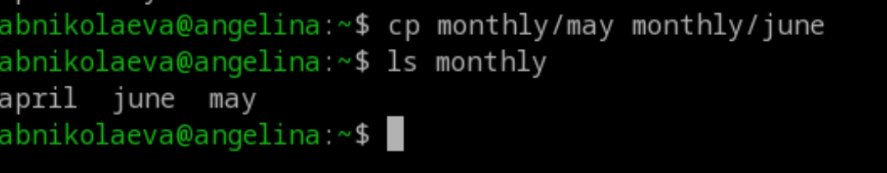

##

Копирую каталог monthly в каталог monthly.00

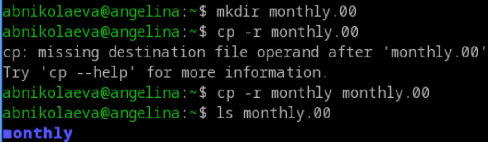

##

Копирую каталог monthly.00 в каталог /tmp

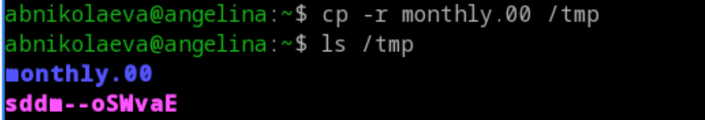

##

Изменяю название файла april на july в домашнем каталоге

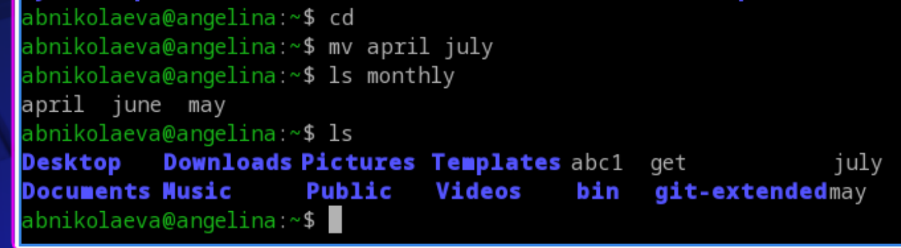

##

Перемещаю файл july в каталог monthly.00

##

Переименовываю каталог monthly.00 в monthly.01

##

Перемещаю каталог monthly.01в каталог reports

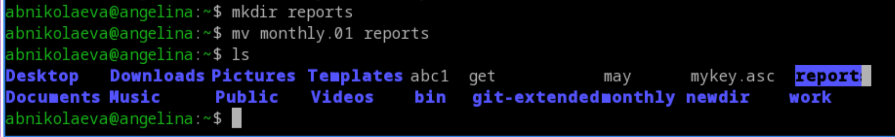

##

Переименовываю каталог reports/monthly.01 в reports/monthly

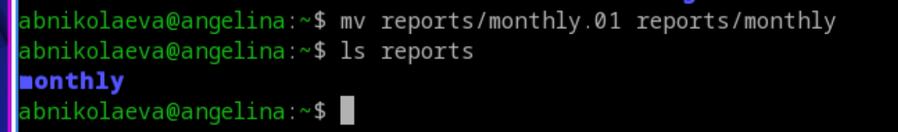

##

Создаю файл ~/may с правом выполнения для владельца, лишаю владельца файла ~/may права на выполнение

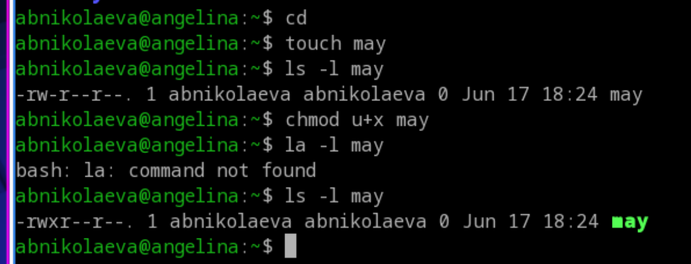

##

Создаю каталог monthly с запретом на чтение для членов группы и всех остальных пользователей

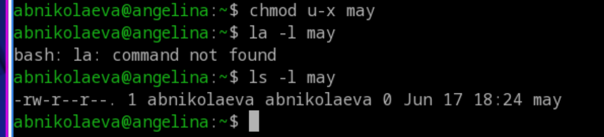

##

Создаю файл ~/abc1 с правом записи для членов группы

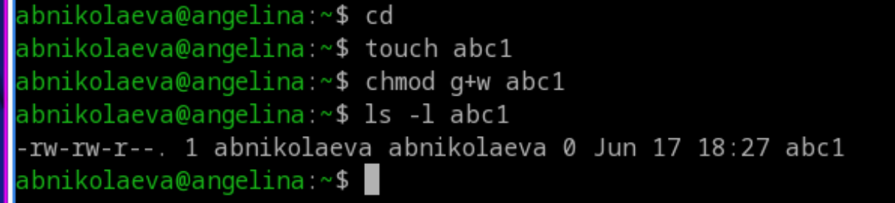

##

*2.*  Выполните следующие действия, зафиксировав в отчёте по лабораторной работе используемые при этом команды и результаты их выполнения

Копирую файл /usr/include/sys/io.h в домашний каталог и называю его equipment.

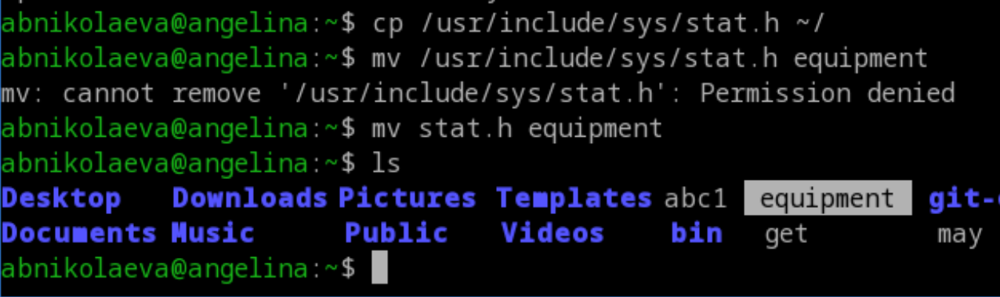

##

В домашнем каталоге создаю директорию ~/ski.plases. Перемещаю файл equipment в каталог ~/ski.plases.

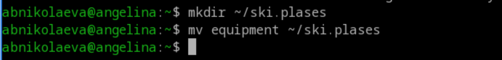

##

Переименовываю файл ~/ski.plases/equipment в ~/ski.plases/equiplist.

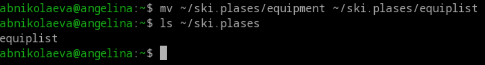

##

Создаю в домашнем каталоге файл abc1 и копирую его в каталог ~/ski.plases, называю его equiplist2.

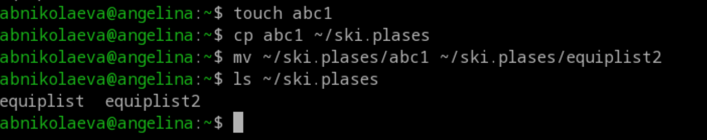

##

Создаю каталог с именем equipment в каталоге ~/ski.plases, перемещаю файлы ~/ski.plases/equiplist и equiplist2 в каталог ~/ski.plases/equipment.

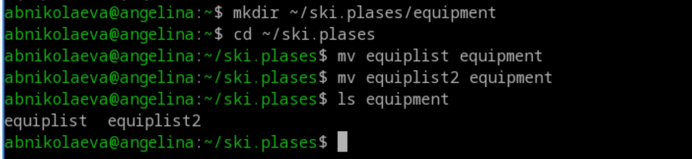

##

Создаю и перемещаю каталог ~/newdir в каталог ~/ski.plases и назоваю его plans.

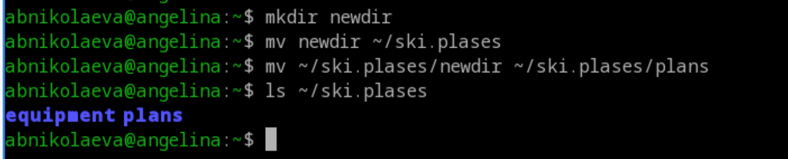

##

*3.* Определите опции команды chmod, необходимые для того, чтобы присвоить перечисленным ниже файлам выделенные права доступа, считая, что в начале таких прав нет:
* 3.1. drwxr--r-- ... australia
* 3.2. drwx--x--x ... play
* 3.3. -r-xr--r-- ... my_os
* 3.4. -rw-rw-r-- ... feathers

##
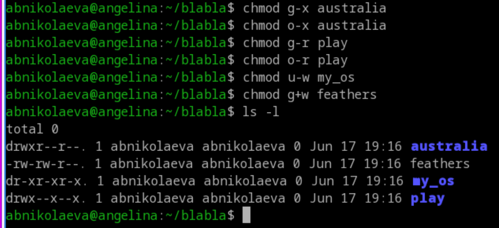

##

*4.* Проделайте приведённые ниже упражнения, записывая в отчёт по лабораторной
работе используемые при этом команды

Просмотриваю содержимое файла /etc/password.

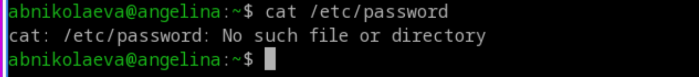

##

Копирую файл ~/feathers в файл ~/file.old, перемещаю файл ~/file.old в каталог ~/play

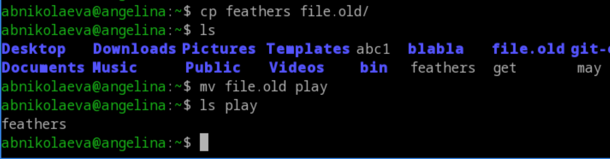

##

Копирую каталог ~/play в каталог ~/fun, перемещаю каталог ~/fun в каталог ~/play и называю его games

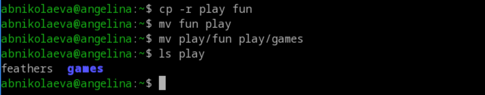

##

Лишаю владельца файла ~/feathers права на чтение.

Что произойдёт, если вы попытаетесь просмотреть файл ~/feathers командой cat?
Что произойдёт, если вы попытаетесь скопировать файл ~/feathers?

В обоих случаях отказывает в доступе

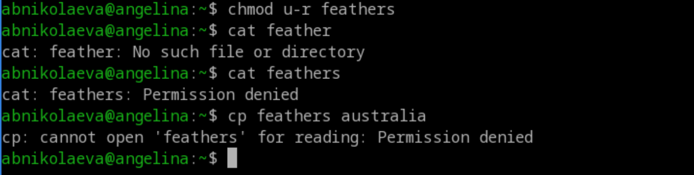

##

Даю владельцу файла ~/feathers право на чтение.
Лишаю владельца каталога ~/play права на выполнение.
Перехожу в каталог ~/play. Что произошло?

##

Отказано в доступе

Даю владельцу каталога ~/play право на выполнение.

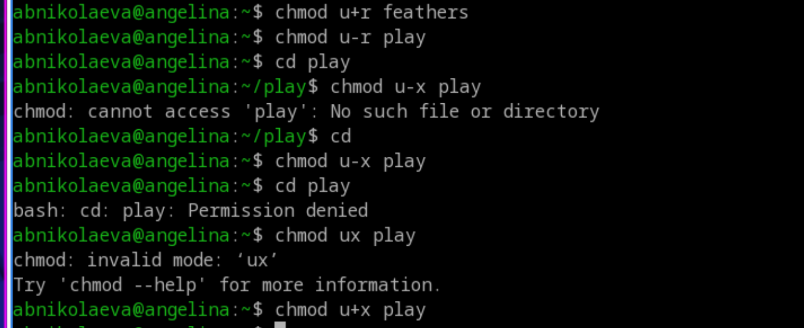

##

*5.* Прочитайте man по командам mount, fsck, mkfs, kill и кратко их охарактеризуйте,
приведя примеры.

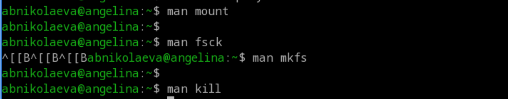

##
* mount - Подключение файловых систем к дереву каталогов.
* fsck - Проверка и исправление ошибок файловой системы.
* mkfs - Создание новой файловой системы.
* kill - Отправка сигналов процессам (управление их жизненным циклом).

# Выводы

Во время выполнения лабораторной работы я приобрела практические навыки взаимодействия пользователя с файловой системой Linux посредством командной строки.
