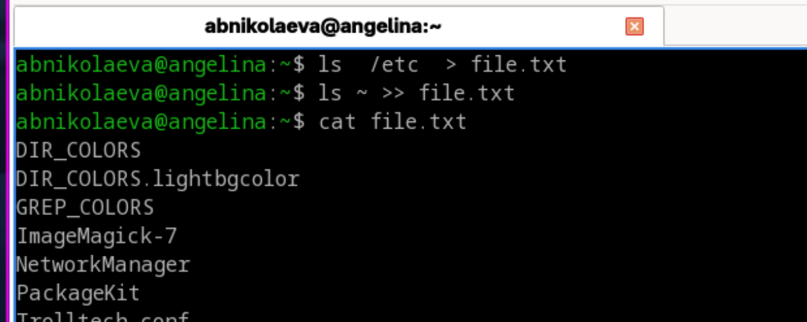
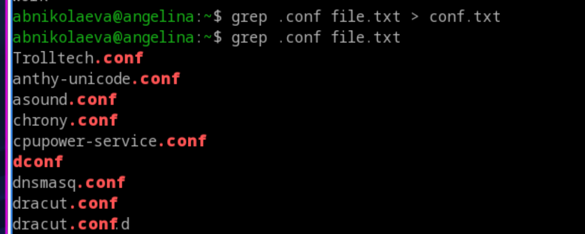
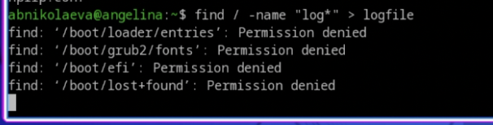
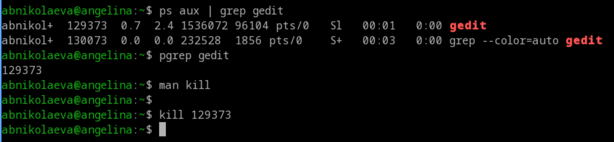

---
## Front matter
lang: ru-RU
title: Лабораторная работа №8
subtitle: Операционные системы
author:
  - Николаева А. Б.
institute:
  - Российский университет дружбы народов, Москва, Россия
date: 15 июня 2026

## i18n babel
babel-lang: russian
babel-otherlangs: english

## Formatting pdf
toc: false
toc-title: Содержание
slide_level: 2
aspectratio: 169
section-titles: true
theme: metropolis
header-includes:
 - \metroset{progressbar=frametitle,sectionpage=progressbar,numbering=fraction}
---

# Информация

## Докладчик

:::::::::::::: {.columns align=center}
::: {.column width="70%"}

  * Николаева Ангелина Борисовна
  * Студентка НКАбд-04-25
  * Российский университет дружбы народов
  * [1032253612@rudn.ru]

:::
::: {.column width="30%"}

:::
::::::::::::::

# Цель работы 

* ознакомление с инструментами поиска файлов и фильтрации текстовых данных.
* приобретение практических навыков: по управлению процессами (и заданиями), по проверке использования диска и обслуживанию файловых систем.

# Задание

1. Осуществите вход в систему, используя соответствующее имя пользователя.
2. Запишите в файл file.txt названия файлов, содержащихся в каталоге /etc. Допишите в этот же файл названия файлов, содержащихся в вашем домашнем каталоге.
3. Выведите имена всех файлов из file.txt, имеющих расширение .conf, после чего запишите их в новый текстовой файл conf.txt.
4. Определите, какие файлы в вашем домашнем каталоге имеют имена, начинавшиеся с символа c? Предложите несколько вариантов, как это сделать.
5. Выведите на экран (по странично) имена файлов из каталога /etc, начинающиеся с символа h.

##

6. Запустите в фоновом режиме процесс, который будет записывать в файл ~/logfile файлы, имена которых начинаются с log.
7. Удалите файл ~/logfile.
8. Запустите из консоли в фоновом режиме редактор gedit.
9. Определите идентификатор процесса gedit, используя команду ps, конвейер и фильтр grep. Как ещё можно определить идентификатор процесса?
10. Прочтите справку (man) команды kill, после чего используйте её для завершения процесса gedit.
11. Выполните команды df и du, предварительно получив более подробную информацию об этих командах, с помощью команды man.
12. Воспользовавшись справкой команды find, выведите имена всех директорий, имеющихся в вашем домашнем каталоге.

# Выполнение лабораторной работы

1. Осуществляю вход в систему, используя соответствующее имя пользователя.

##
2. Записываю в файл file.txt названия файлов, содержащихся в каталоге /etc. Дописываю в этот же файл названия файлов, содержащихся в моём домашнем каталоге.

##
3. Вывожу имена всех файлов из file.txt, имеющих расширение .conf, после чего записываю их в новый текстовой файл conf.txt.

##
4. Определяю, какие файлы в вашем домашнем каталоге имеют имена, начинавшиеся с символа c. Пишу несколько вариантов, как это сделать.

##
5. Вывожу на экран (по странично) имена файлов из каталога /etc, начинающиеся с символа h.

##
6. Запускаю в фоновом режиме процесс, который будет записывать в файл ~/logfile файлы, имена которых начинаются с log.

##
7. Удаляю файл ~/logfile.
8. Запускаю из консоли в фоновом режиме редактор gedit.

##
9. Определяю идентификатор процесса gedit, используя команду ps, конвейер и фильтр grep. 
10. Читаю справку (man) команды kill, после чего использую её для завершения процесса gedit.

##
11. Выполняю команды df и du, предварительно получив более подробную информацию об этих командах с помощью команды man.

##
12. Воспользовавшись справкой команды find, вывожу имена всех директорий, имеющихся в вашем домашнем каталоге.

# Выводы

Во время выполнения лабораторной работы я ознакомилась с инструментами поиска файлов и фильтрации текстовых данных, приобрела практические навыки: по управлению процессами (и заданиями), по проверке использования диска и обслуживанию файловых систем.

