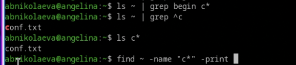
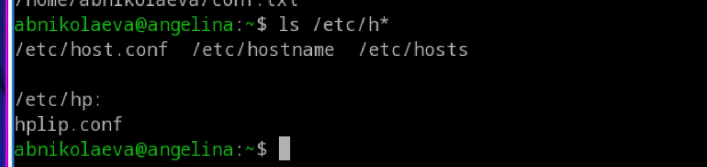
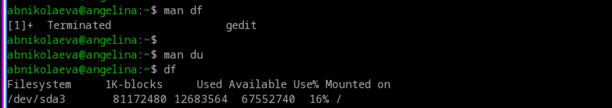

---
## Author
author:
  name: Николаева Ангелина Борисовна
  degrees: DSc
  orcid: 0000-0002-0877-7063
  email: 1032253612@rudn.ru
  affiliation:
    - name: Российский университет дружбы народов
      country: Российская Федерация
      postal-code: 117198
      city: Москва
      address: ул. Миклухо-Маклая, д. 6

## Title
title: "Лабораторная работа №8"
subtitle: "Поиск файлов. Перенаправление ввода-вывода. Просмотр запущенных процессов."
license: "CC BY"
---

# 1. Цель работы

Ознакомление с инструментами поиска файлов и фильтрации текстовых данных. Приобретение практических навыков: по управлению процессами (и заданиями), по проверке использования диска и обслуживанию файловых систем.

# 2. Задание

1. Осуществите вход в систему, используя соответствующее имя пользователя.
2. Запишите в файл file.txt названия файлов, содержащихся в каталоге /etc. Допишите в этот же файл названия файлов, содержащихся в вашем домашнем каталоге.
3. Выведите имена всех файлов из file.txt, имеющих расширение .conf, после чего запишите их в новый текстовой файл conf.txt.
4. Определите, какие файлы в вашем домашнем каталоге имеют имена, начинавшиеся с символа c? Предложите несколько вариантов, как это сделать.
5. Выведите на экран (по странично) имена файлов из каталога /etc, начинающиеся с символа h.
6. Запустите в фоновом режиме процесс, который будет записывать в файл ~/logfile файлы, имена которых начинаются с log.
7. Удалите файл ~/logfile.
8. Запустите из консоли в фоновом режиме редактор gedit.
9. Определите идентификатор процесса gedit, используя команду ps, конвейер и фильтр grep. Как ещё можно определить идентификатор процесса?
10. Прочтите справку (man) команды kill, после чего используйте её для завершения процесса gedit.
11. Выполните команды df и du, предварительно получив более подробную информацию об этих командах, с помощью команды man.
12. Воспользовавшись справкой команды find, выведите имена всех директорий, имеющихся в вашем домашнем каталоге.

# 3. Теоретическое введение

Операционная система Linux предоставляет пользователю мощные средства для работы с файловой системой, процессами и потоками ввода-вывода. Взаимодействие с системой осуществляется через командную оболочку (например, Bash), которая интерпретирует вводимые команды и управляет их выполнением.

Любая команда или программа при запуске получает три стандартных потока: stdin (стандартный ввод, обычно клавиатура), stdout (стандартный вывод, обычно экран) и stderr (стандартный вывод ошибок, также экран). Эти потоки можно перенаправлять в файлы или связывать между собой. Перенаправление позволяет сохранять результаты работы команд в файлах или передавать вывод одной команды на ввод другой с помощью конвейера (|).

Важной задачей при работе в командной строке является поиск файлов и фильтрация текстовой информации. Для этого используются утилиты find (поиск файлов по различным критериям) и grep (поиск строк в тексте).

В многозадачной среде Linux каждый запущенный процесс имеет уникальный идентификатор (PID). Пользователь может запускать процессы в фоновом режиме, просматривать список активных процессов, управлять ими и завершать их с помощью команд jobs, ps, kill. Кроме того, для оценки использования дискового пространства применяются команды df (информация о разделах) и du (оценка размера каталогов и файлов).

Освоение перечисленных инструментов является необходимым для эффективной работы администратора и пользователя в системе Linux.

# 4. Выполнение лабораторной работы

1. Осуществляю вход в систему, используя соответствующее имя пользователя.

2. Записываю в файл file.txt названия файлов, содержащихся в каталоге /etc. Дописываю в этот же файл названия файлов, содержащихся в моём домашнем каталоге.

{#fig-001 width=70%}

3. Вывожу имена всех файлов из file.txt, имеющих расширение .conf, после чего записываю их в новый текстовой файл conf.txt.

{#fig-002 width=70%}

4. Определяю, какие файлы в вашем домашнем каталоге имеют имена, начинавшиеся с символа c. Пишу несколько вариантов, как это сделать.

{#fig-003 width=70%}

5. Вывожу на экран (по странично) имена файлов из каталога /etc, начинающиеся с символа h.

{#fig-004 width=70%}

6. Запускаю в фоновом режиме процесс, который будет записывать в файл ~/logfile файлы, имена которых начинаются с log.

{#fig-005 width=70%}

7. Удаляю файл ~/logfile.
8. Запускаю из консоли в фоновом режиме редактор gedit.

{#fig-006 width=70%}

9. Определяю идентификатор процесса gedit, используя команду ps, конвейер и фильтр grep. 
10. Читаю справку (man) команды kill, после чего использую её для завершения процесса gedit.

{#fig-007 width=70%}

11. Выполняю команды df и du, предварительно получив более подробную информацию об этих командах с помощью команды man.

{#fig-008 width=70%}

12. Воспользовавшись справкой команды find, вывожу имена всех директорий, имеющихся в вашем домашнем каталоге.

{#fig-009 width=70%}

# 5. Выводы

Во время выполнения лабораторной работы я ознакомилась с инструментами поиска файлов и фильтрации текстовых данных, приобрела практические навыки: по управлению процессами (и заданиями), по проверке использования диска и обслуживанию файловых систем.

# Список литературы{.unnumbered}

::: {#refs}
:::

