---
## Front matter
lang: ru-RU
title: Лабораторная работа №9
subtitle: Операционные системы
author:
  - Николаева А. Б.
institute:
  - Российский университет дружбы народов, Москва, Россия
date: 15 июня 2026

## i18n babel
babel-lang: russian
babel-otherlangs: english

## Formatting pdf
toc: false
toc-title: Содержание
slide_level: 2
aspectratio: 169
section-titles: true
theme: metropolis
header-includes:
 - \metroset{progressbar=frametitle,sectionpage=progressbar,numbering=fraction}
---

# Информация

## Докладчик

:::::::::::::: {.columns align=center}
::: {.column width="70%"}

  * Николаева Ангелина Борисовна
  * Студентка НКАбд-04-25
  * Российский университет дружбы народов
  * [1032253612@rudn.ru]

:::
::: {.column width="30%"}

:::
::::::::::::::

# Цель работы 

* освоение основных возможностей командной оболочки Midnight Commander
* приобретение навыков практической работы по просмотру каталогов и файлов; манипуляций с ними

# Выполнение лабораторной работы

1. Изучим информацию о mc при помощи справки man.
Воспользуемся справкой и узнаем что для того чтобы войти в командную оболочку мы должны ввести в командной строке mc.

##

2. Запустим из командной строки mc.

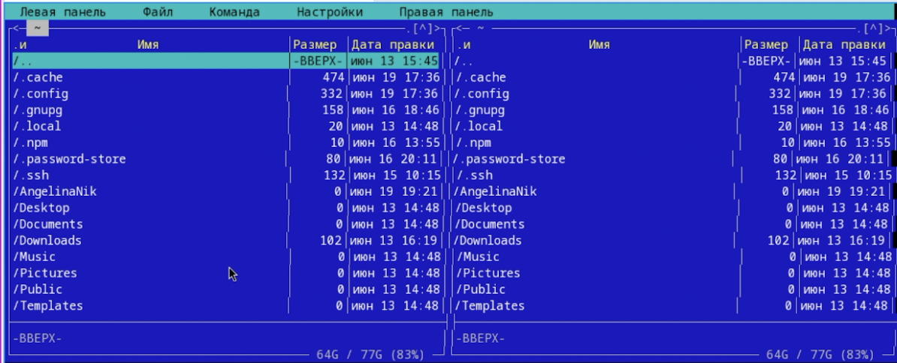

##
3. Выполните несколько операций в mc, используя управляющие клавиши

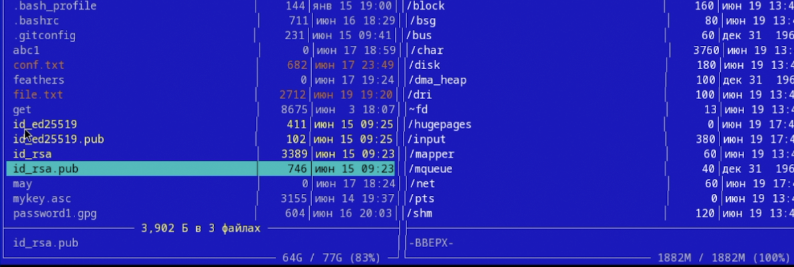

##
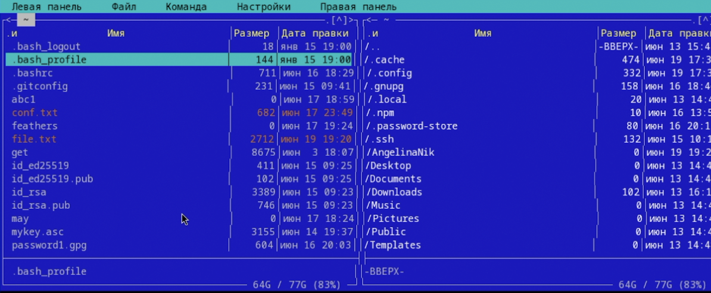

##
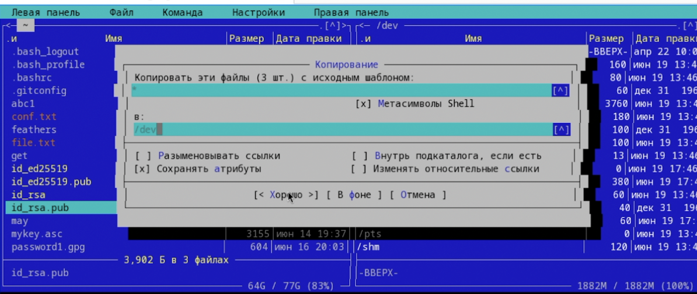

##

##
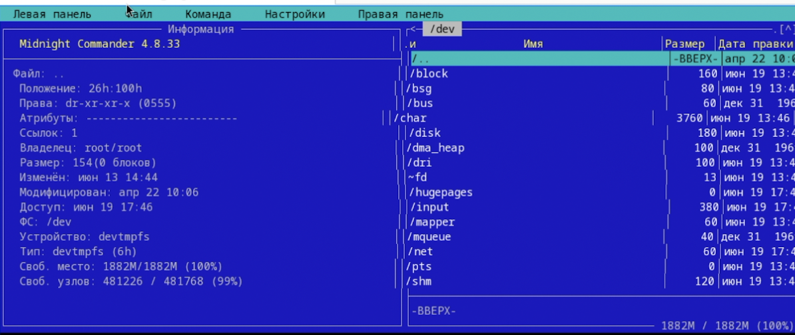

##
4. Выполните основные команды меню левой панели. 

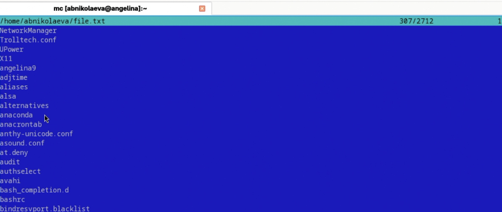

##
5. Используя возможности подменю Файл , выполним:

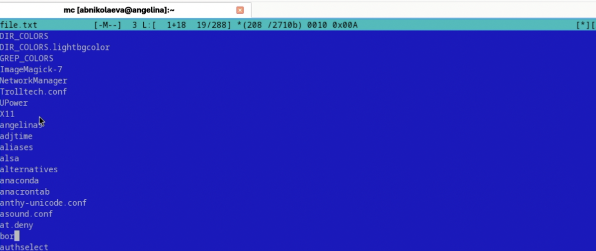

##
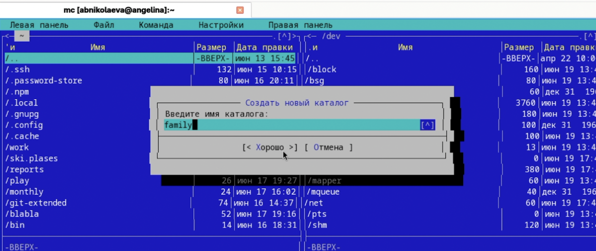

##
6. С помощью соответствующих средств подменю Команда осуществите: 

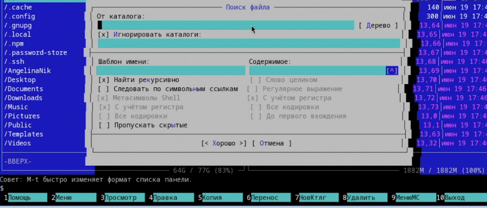

##
7. Вызовем подменю Настройки. Изучим опции

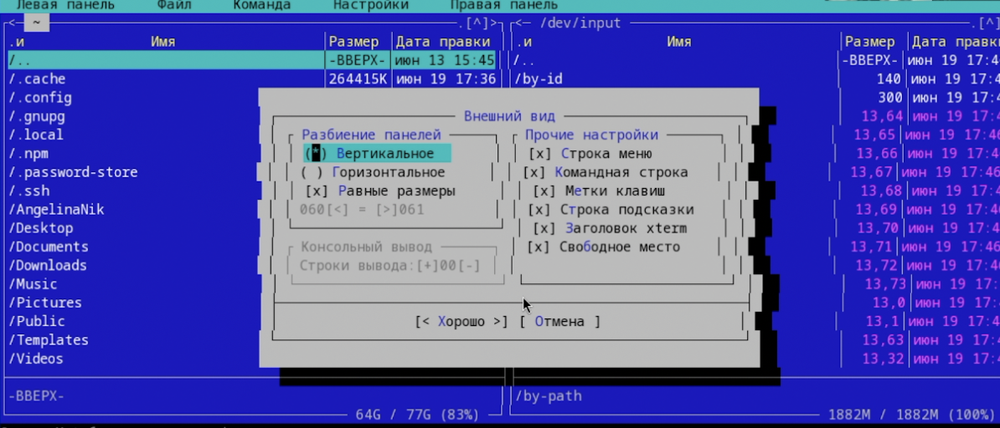

##
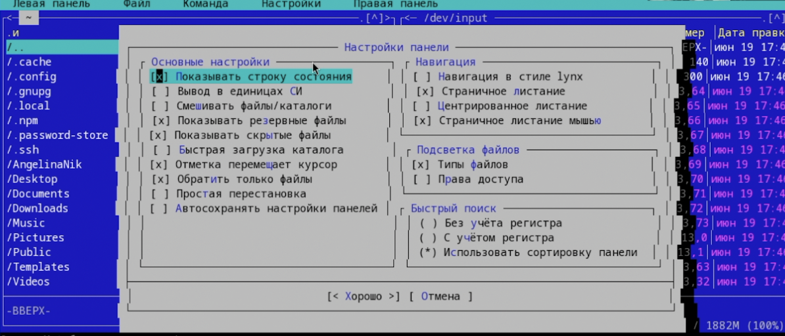

##
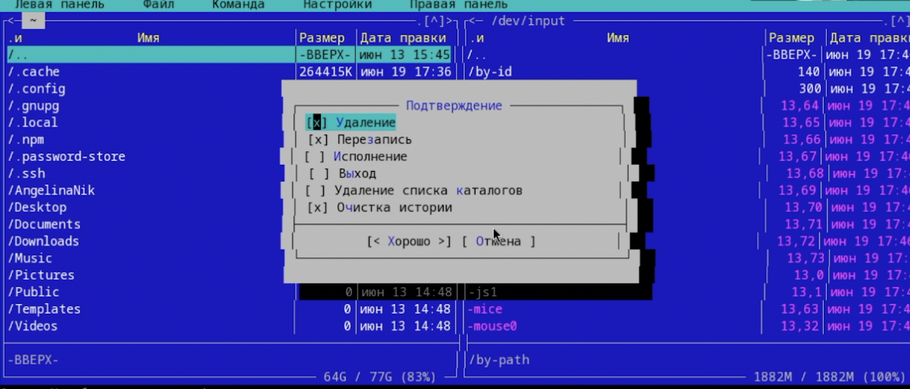

##
8. Создадим текстовой файл text.txt. 

9. Откроем этот файл с помощью встроенного в mc редактора, и вставим в открытый файл небольшой фрагмент текста, скопированный из любого другого файла или Интернета. 

##
10. Проделаем с текстом следующие манипуляции, используя горячие клавиши:

Удалим строку текста. - F8

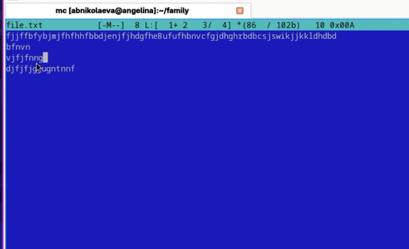

##
Выделим фрагмент текста и скопируйте его на новую строку. - F5

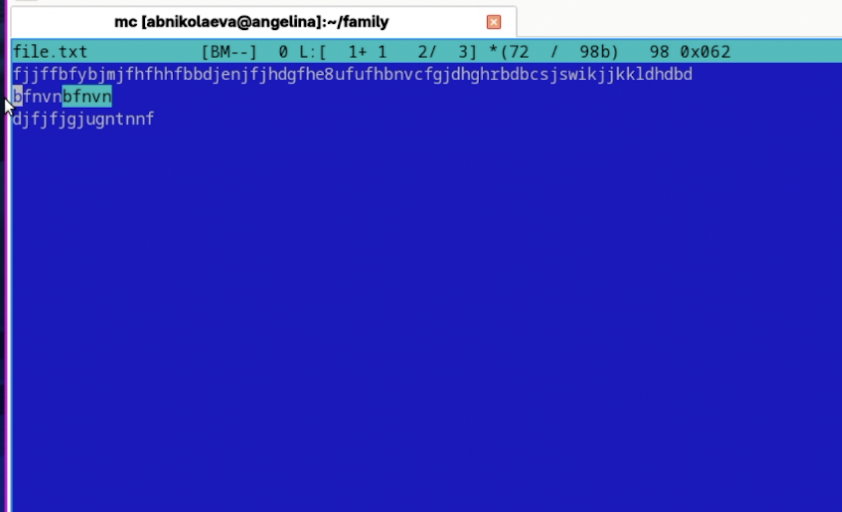

##
Сохраним файл. - F2

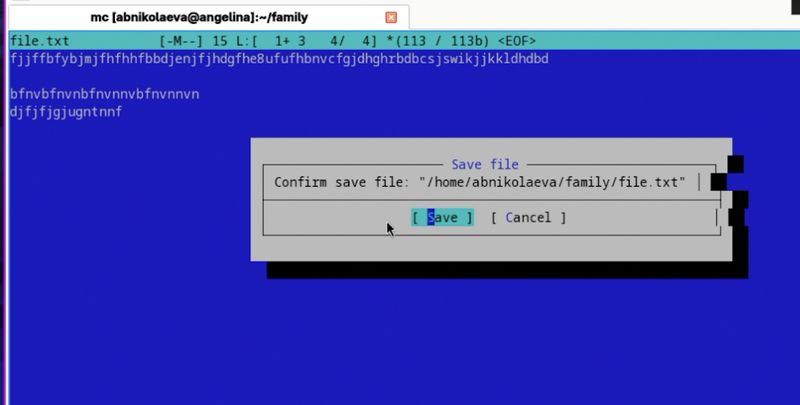

##
11. Откроем файл с исходным текстом на языке программирования C

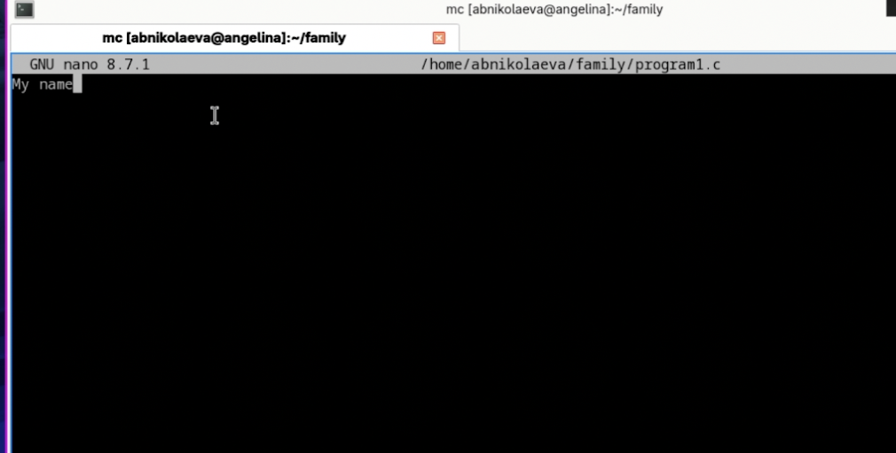

##
12. Используя меню редактора, выключим подсветку синтаксиса.

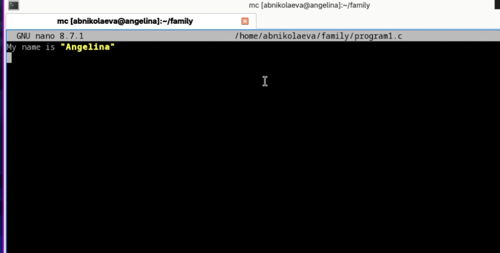

# Вывод

В данной работе мы ознакомились с инструментами командной оболочки Midnight Commander. Приобрели навыки практической работы по просмотру каталогов и файлов 

