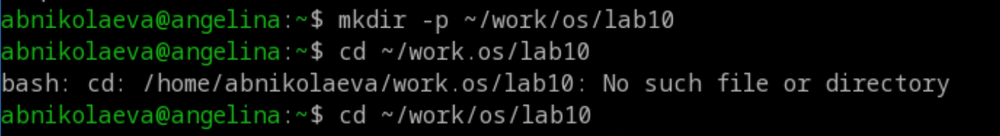
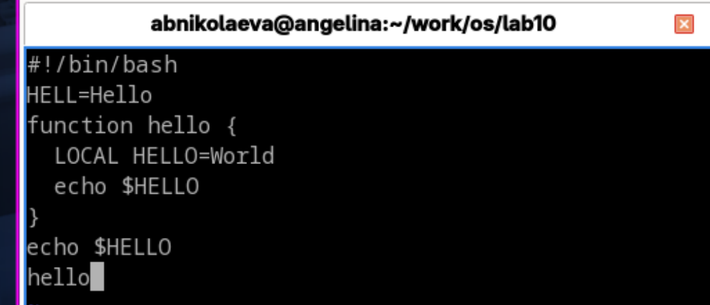
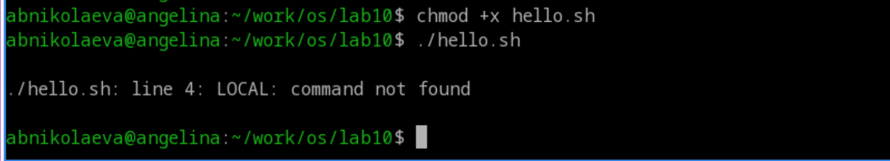
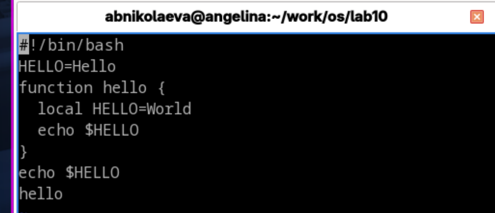
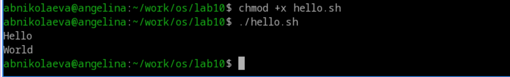

---
## Front matter
lang: ru-RU
title: Лабораторная работа №10
subtitle: Операционные системы
author:
  - Николаева А. Б.
institute:
  - Российский университет дружбы народов, Москва, Россия
date: 20 июня 2026

## i18n babel
babel-lang: russian
babel-otherlangs: english

## Formatting pdf
toc: false
toc-title: Содержание
slide_level: 2
aspectratio: 169
section-titles: true
theme: metropolis
header-includes:
 - \metroset{progressbar=frametitle,sectionpage=progressbar,numbering=fraction}
---

# Информация

## Докладчик

:::::::::::::: {.columns align=center}
::: {.column width="70%"}

  * Николаева Ангелина Борисовна
  * Студентка НКАбд-04-25
  * Российский университет дружбы народов
  * [1032253612@rudn.ru]

:::
::: {.column width="30%"}

:::
::::::::::::::

# Цель работы 

* познакомиться с операционной системой Linux
* получить практические навыки работы с редактором vi, установленным по умолчанию практически во всех дистрибутивах

# Выполнение лабораторной работы

1. Создадим каталог с именем ~/work/os/lab10. 

2. Перейдем во вновь созданный каталог. 

##
3. Вызовем vi и создадим файл hello.sh vi hello.sh 

4. Нажмем клавишу i и введем текст из задания.
 
5. Нажмем клавишу Esc для перехода в командный режим после завершения ввода текста. 

6. Нажмем : для перехода в режим последней строки и внизу нашего экрана появится приглашение в виде двоеточия. 

##
7. Нажмем w (записать) и q (выйти), а затем нажмем клавишу Enter для сохранения нашего текста и завершения работы. 

##
8. Сделаем наш файл исполняемым и попытаемся его исполнить.

{ #fig:003 width=70% height=70% }

##
9. Вызовем vi на редактирование файла vi ~/work/os/lab10/hello.sh 

10. Установим курсор в конец слова HELL второй строки. 

11. Перейдем в режим вставки и заменим на HELLO. Нажмем Esc для возврата в командный режим. 

12. Установим курсор на четвертую строку и сотрем слово LOCAL. 

13. Перейдем в режим вставки и наберем следующий текст: local, нажмем Esc для возврата в командный режим. 

##
14. Установим курсор на последней строке файла. Вставим после неё строку, со- держащую следующий текст: echo $HELLO. 

15. Нажмем Esc для перехода в командный режим. 

16. Удалим последнюю строку. 

17. Введем команду отмены изменений u для отмены последней команды. 

##
18. Введем символ : для перехода в режим последней строки. Запишем произведённые изменения и выйдем из vi.

##

# Выводы

В ходе роботы мы  познакомились с операционной системой Linux, и получили практические навыки работы с редактором vi, установленным по умолчанию практически во всех дистрибутивах UNIX.

