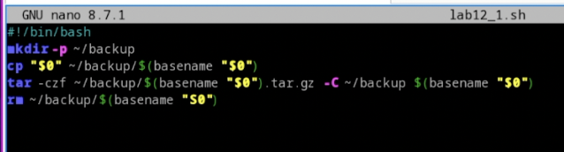
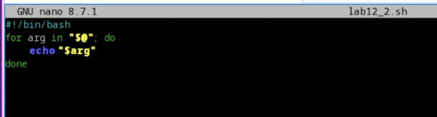
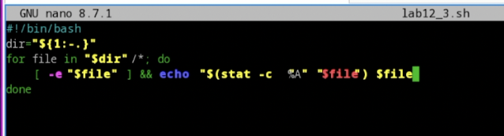
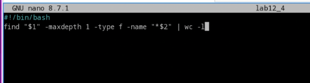

---
## Front matter
lang: ru-RU
title: Лабораторная работа №12
subtitle: Операционные системы
author:
  - Николаева А. Б.
institute:
  - Российский университет дружбы народов, Москва, Россия
date: 20 июня 2026

## i18n babel
babel-lang: russian
babel-otherlangs: english

## Formatting pdf
toc: false
toc-title: Содержание
slide_level: 2
aspectratio: 169
section-titles: true
theme: metropolis
header-includes:
 - \metroset{progressbar=frametitle,sectionpage=progressbar,numbering=fraction}
---

# Информация

## Докладчик

:::::::::::::: {.columns align=center}
::: {.column width="70%"}

  * Николаева Ангелина Борисовна
  * Студентка НКАбд-04-25
  * Российский университет дружбы народов
  * [1032253612@rudn.ru]

:::
::: {.column width="30%"}


:::
::::::::::::::

# Цель работы 

* изучить основы программирования в оболочке ОС UNIX/Linux 
* научиться писать небольшие командные файлы

# Выполнение лабораторной работы

1. Написали скрипт, который при запуске делает резервную копию самого себя (то есть файла, в котором содержится его исходный код) в другую директорию backup в моём домашнем каталоге. При этом файл архивируется одним из архиваторов на выбор zip , bzip2 или tar . Способ использования команд архивации узнали, изучив справку.

##
Комментарий: командой cp копируем файл в директорию ~/backup/, а командой gzip исходный файл архивируется и удаляется (остаётся только архив).



##
2. Написали пример командного файла, обрабатывающего любое произвольное число аргументов командной строки, в том числе превышающее десять. Например, скрипт может последовательно распечатывать значения всех переданных аргументов

```
for i — для всех переданных аргументов
    do echo $1 — выводим первый аргумент
       shift — удаляем первый аргумент, смещаем все аргументы
done — конец цикла
```

##


##
3. Написали командный файл — аналог команды ls (без использования самой этой команды и команды dir ). Он выдает информацию о нужном каталоге и выводит информацию о возможностях доступа к файлам этого каталога.

Если не использовать команду ls или команду dir, то данную задачу легко выполнить с помощью команды find, если указать ей опцию поиска файлов с определенным правом доступа

##


##
4. Написали командный файл, который получает в качестве аргумента командной строки формат файла ( .txt , .doc , .jpg , .pdf и т.д.) и вычисляет количество таких файлов в указанной директории. Путь к директории также передаётся в виде аргумента командной строки.

Ищем командой find в каталоге $1 (первый аргумент) файлы заканчивающиеся "*" на нужное расширение $2 (аргумент второй) передаем вывод | в команду подсчета wc с аргументом считающим слова -l

##


# Выводы
В данной работе мы изучили основы программирования в оболочке ОС UNIX/Linux. Научились писать небольшие командные файлы и скрипты на языке bush.

